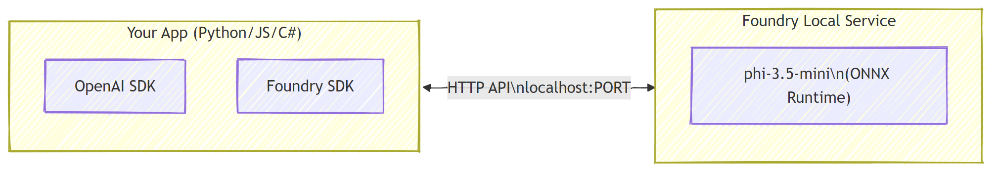

# Part 1: Getting Started with Foundry Local


## What is Foundry Local?

[Foundry Local](https://foundrylocal.ai) lets you run open-source AI language models **directly on your computer** — no internet required, no cloud costs, and complete data privacy. It:

- **Downloads and runs models locally** with automatic hardware optimization (GPU, CPU, or NPU)
- **Provides an OpenAI-compatible API** so you can use familiar SDKs and tools
- **Requires no Azure subscription** or sign-up — just install and start building

Think of it as having your own private AI that runs entirely on your machine.

## Learning Objectives

By the end of this lab you will be able to:

- Install the Foundry Local CLI on your operating system
- Understand what model aliases are and how they work
- Download and run your first local AI model
- Send a chat message to a local model from the command line
- Understand the difference between local and cloud-hosted AI models

---

## Prerequisites

### System Requirements

| Requirement | Minimum | Recommended |
|-------------|---------|-------------|
| **RAM** | 8 GB | 16 GB |
| **Disk Space** | 5 GB (for models) | 10 GB |
| **CPU** | 4 cores | 8+ cores |
| **GPU** | Optional | NVIDIA with CUDA 11.8+ |
| **OS** | Windows 10/11 (x64/ARM), Windows Server 2025, macOS 13+ | — |

> **Note:** Foundry Local automatically selects the best model variant for your hardware. If you have an NVIDIA GPU, it uses CUDA acceleration. If you have a Qualcomm NPU, it uses that. Otherwise it falls back to an optimized CPU variant.

### Install Foundry Local CLI

**Windows** (PowerShell):
```powershell
winget install Microsoft.FoundryLocal
```

**macOS** (Homebrew):
```bash
brew tap microsoft/foundrylocal
brew install foundrylocal
```

> **Note:** Foundry Local currently supports Windows and macOS only. Linux is not supported at this time.

Verify the installation:
```bash
foundry --version
```

---

## Lab Exercises

### Exercise 1: Explore Available Models

Foundry Local includes a catalog of pre-optimized open-source models. List them:

```bash
foundry model list
```

You'll see models like:
- `phi-3.5-mini` — Microsoft's 3.8B parameter model (fast, good quality)
- `phi-4-mini` — Newer, more capable Phi model
- `qwen2.5-0.5b` — Very small and fast (good for low-resource devices)
- `deepseek-r1` — Strong reasoning model

> **What is a model alias?** Aliases like `phi-3.5-mini` are shortcuts. When you use an alias, Foundry Local automatically downloads the best variant for your specific hardware (CUDA for NVIDIA GPUs, CPU-optimized otherwise). You never need to worry about picking the right variant.

### Exercise 2: Run Your First Model

Download and start chatting with a model interactively:

```bash
foundry model run phi-3.5-mini
```

The first time you run this, Foundry Local will:
1. Detect your hardware
2. Download the optimal model variant (this may take a few minutes)
3. Load the model into memory
4. Start an interactive chat session

Try asking it some questions:
```
You: What is the golden ratio?
You: Can you explain it like I'm 10 years old?
You: Write a haiku about mathematics
```

Type `exit` or press `Ctrl+C` to quit.

### Exercise 3: Pre-download a Model

If you want to download a model without starting a chat:

```bash
foundry model download phi-3.5-mini
```

Check which models are already downloaded on your machine:

```bash
foundry cache list
```

### Exercise 4: Understand the Architecture

Foundry Local runs as a **local HTTP service** that exposes an OpenAI-compatible REST API. This means:

1. The service starts on a **dynamic port** (a different port each time)
2. You use the SDK to discover the actual endpoint URL
3. You can use **any** OpenAI-compatible client library to talk to it



> **Important:** Foundry Local assigns a **dynamic port** each time it starts. Never hardcode a port number like `localhost:5272`. Always use the SDK's `manager.endpoint` property to get the current URL.

---

## Key Takeaways

- Foundry Local runs AI models **entirely on your device** — no cloud, no API keys, no costs
- Model **aliases** (like `phi-3.5-mini`) automatically select the best variant for your hardware
- The Foundry Local service runs on a **dynamic port** — always use the SDK to discover the endpoint
- You can interact with models via the CLI (`foundry model run`) or programmatically via the SDK

---

## Next Steps

Continue to [Part 2: Using the Foundry Local SDK](part2-sdk-and-apis.md) to learn how to integrate Foundry Local into your Python, JavaScript, or C# applications.
