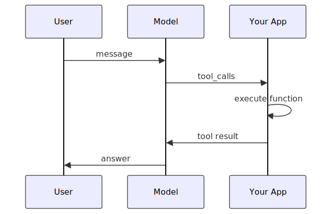

# Part 11: Tool Calling with Local Models

> **Goal:** Enable your local model to call external functions (tools) so it can retrieve real-time data, perform calculations, or interact with APIs — all running privately on your device.

## What Is Tool Calling?

Tool calling (also known as **function calling**) lets a language model request the execution of functions you define. Instead of guessing an answer, the model recognises when a tool would help and returns a structured request for your code to execute. Your application runs the function, sends the result back, and the model incorporates that information into its final response.


This pattern is essential for building agents that can:

- **Look up live data** (weather, stock prices, database queries)
- **Perform precise calculations** (maths, unit conversions)
- **Take actions** (send emails, create tickets, update records)
- **Access private systems** (internal APIs, file systems)

---

## How Tool Calling Works

The tool-calling flow has four stages:

| Stage | What Happens |
|-------|-------------|
| **1. Define tools** | You describe available functions using JSON Schema — name, description, and parameters |
| **2. Model decides** | The model receives your message plus the tool definitions. If a tool would help, it returns a `tool_calls` response instead of a text answer |
| **3. Execute locally** | Your code parses the tool call, runs the function, and collects the result |
| **4. Final answer** | You send the tool result back to the model, which produces its final response |

> **Key point:** The model never executes code. It only *requests* that a tool be called. Your application decides whether to honour that request — this keeps you in full control.

---

## Which Models Support Tool Calling?

Not every model supports tool calling. In the current Foundry Local catalogue, the following models have tool-calling capability:

| Model | Size | Tool Calling |
|-------|------|:---:|
| qwen2.5-0.5b | 822 MB | ✅ |
| qwen2.5-1.5b | 1.8 GB | ✅ |
| qwen2.5-7b | 6.3 GB | ✅ |
| qwen2.5-14b | 11.3 GB | ✅ |
| qwen2.5-coder-0.5b | 822 MB | ✅ |
| qwen2.5-coder-1.5b | 1.8 GB | ✅ |
| qwen2.5-coder-7b | 6.3 GB | ✅ |
| qwen2.5-coder-14b | 11.3 GB | ✅ |
| phi-4-mini | 4.6 GB | ✅ |
| phi-3.5-mini | 2.6 GB | ❌ |
| phi-4 | 10.4 GB | ❌ |

> **Tip:** For this lab we use **qwen2.5-0.5b** — it is small (822 MB download), fast, and has reliable tool-calling support.

---

## Learning Objectives

By the end of this lab you will be able to:

- Explain the tool-calling pattern and why it matters for AI agents
- Define tool schemas using the OpenAI function-calling format
- Handle the multi-turn tool-calling conversation flow
- Execute tool calls locally and return results to the model
- Choose the right model for tool-calling scenarios

---

## Prerequisites

| Requirement | Details |
|-------------|---------|
| **Foundry Local CLI** | Installed and on your `PATH` ([Part 1](part1-getting-started.md)) |
| **Foundry Local SDK** | Python, JavaScript, or C# SDK installed ([Part 2](part2-foundry-local-sdk.md)) |
| **A tool-calling model** | qwen2.5-0.5b (will be downloaded automatically) |

---

## Exercises

### Exercise 1 — Understand the Tool-Calling Flow

Before writing code, study this sequence diagram:



**Key observations:**

1. You define the tools upfront as JSON Schema objects
2. The model's response contains `tool_calls` instead of regular content
3. Each tool call has a unique `id` you must reference when returning results
4. The model sees all previous messages *plus* the tool results when generating the final answer
5. Multiple tool calls can happen in a single response

> **Discussion:** Why does the model return tool calls rather than executing functions directly? What security advantages does this provide?

---

### Exercise 2 — Defining Tool Schemas

Tools are defined using the standard OpenAI function-calling format. Each tool needs:

- **`type`**: Always `"function"`
- **`function.name`**: A descriptive function name (e.g. `get_weather`)
- **`function.description`**: A clear description — the model uses this to decide when to call the tool
- **`function.parameters`**: A JSON Schema object describing the expected arguments

```json
{
  "type": "function",
  "function": {
    "name": "get_weather",
    "description": "Get the current weather for a given city",
    "parameters": {
      "type": "object",
      "properties": {
        "city": {
          "type": "string",
          "description": "The city name, e.g. London"
        }
      },
      "required": ["city"]
    }
  }
}
```

> **Best practices for tool descriptions:**
> - Be specific: "Get the current weather for a given city" is better than "Get weather"
> - Describe parameters clearly: the model reads these descriptions to fill in the right values
> - Mark required vs optional parameters — this helps the model decide what to ask for

---

### Exercise 3 — Run the Tool-Calling Examples

Each language sample defines two tools (`get_weather` and `get_population`), sends a question that triggers tool use, executes the tool locally, and sends the result back for a final answer.

<details>
<summary><strong>🐍 Python</strong></summary>

**Prerequisites:**
```bash
cd python
python -m venv venv

# Windows (PowerShell):
venv\Scripts\Activate.ps1
# macOS / Linux:
source venv/bin/activate

pip install -r requirements.txt
```

**Run:**
```bash
python foundry-local-tool-calling.py
```

**Expected output:**
```
Starting Foundry Local service...
User: What is the weather like in London?

Model requested 1 tool call(s):
  → get_weather({'city': 'London'})

Final response:
The current weather in London is 18°C and partly cloudy.
```

**Code walkthrough** (`python/foundry-local-tool-calling.py`):

```python
# Define tools as a list of function schemas
tools = [
    {
        "type": "function",
        "function": {
            "name": "get_weather",
            "description": "Get the current weather for a given city",
            "parameters": {
                "type": "object",
                "properties": {
                    "city": {"type": "string", "description": "The city name"}
                },
                "required": ["city"]
            }
        }
    }
]

# Send with tools — the model may return tool_calls instead of content
response = client.chat.completions.create(
    model=model_id,
    messages=messages,
    tools=tools,
    tool_choice="auto",
)

# Check if the model wants to call a tool
if response.choices[0].message.tool_calls:
    # Execute the tool and send the result back
    ...
```

</details>

<details>
<summary><strong>🟨 JavaScript (Node.js)</strong></summary>

**Prerequisites:**
```bash
cd javascript
npm install
```

**Run:**
```bash
node foundry-local-tool-calling.mjs
```

**Expected output:**
```
Starting Foundry Local service...
User: What is the weather like in London?

Model requested 1 tool call(s):
  → get_weather({"city":"London"})

Final response:
The current weather in London is 18°C and partly cloudy.
```

**Code walkthrough** (`javascript/foundry-local-tool-calling.mjs`):

This example uses the native Foundry Local SDK's `ChatClient` rather than the OpenAI SDK, demonstrating the convenience `createChatClient()` method:

```javascript
// Get a ChatClient directly from the model object
const chatClient = model.createChatClient();

// Send with tools — ChatClient handles the OpenAI-compatible format
const response = await chatClient.completeChat(messages, tools);
const assistantMessage = response.choices[0].message;

// Check for tool calls
if (assistantMessage.tool_calls && assistantMessage.tool_calls.length > 0) {
    // Execute tools and send results back
    ...
}
```

</details>

<details>
<summary><strong>🟦 C# (.NET)</strong></summary>

**Prerequisites:**
```bash
cd csharp
dotnet restore
```

**Run:**
```bash
dotnet run toolcall
```

**Expected output:**
```
Starting Foundry Local service...
Loading model: qwen2.5-0.5b...
User: What is the weather like in London?

Model requested 1 tool call(s):
  → get_weather({"city":"London"})

Final response:
The current weather in London is 18°C and partly cloudy.
```

**Code walkthrough** (`csharp/ToolCalling.cs`):

C# uses the `ChatTool.CreateFunctionTool` helper to define tools:

```csharp
ChatTool getWeatherTool = ChatTool.CreateFunctionTool(
    functionName: "get_weather",
    functionDescription: "Get the current weather for a given city",
    functionParameters: BinaryData.FromString("""
    {
        "type": "object",
        "properties": {
            "city": { "type": "string", "description": "The city name" }
        },
        "required": ["city"]
    }
    """));

var options = new ChatCompletionOptions();
options.Tools.Add(getWeatherTool);

// Check FinishReason to see if tools were called
if (completion.Value.FinishReason == ChatFinishReason.ToolCalls)
{
    // Execute tools and send results back
    ...
}
```

</details>

---

### Exercise 4 — The Tool-Calling Conversation Flow

Understanding the message structure is critical. Here is the complete flow, showing the `messages` array at each stage:

**Stage 1 — Initial request:**
```json
[
  {"role": "system", "content": "You are a helpful assistant. Use the provided tools."},
  {"role": "user", "content": "What is the weather like in London?"}
]
```

**Stage 2 — Model responds with tool_calls (not content):**
```json
{
  "role": "assistant",
  "tool_calls": [
    {
      "id": "call_abc123",
      "type": "function",
      "function": {
        "name": "get_weather",
        "arguments": "{\"city\": \"London\"}"
      }
    }
  ]
}
```

**Stage 3 — You add the assistant message AND the tool result:**
```json
[
  {"role": "system", "content": "..."},
  {"role": "user", "content": "What is the weather like in London?"},
  {"role": "assistant", "tool_calls": [...]},
  {
    "role": "tool",
    "tool_call_id": "call_abc123",
    "content": "{\"city\": \"London\", \"temperature\": \"18°C\", \"condition\": \"Partly cloudy\"}"
  }
]
```

**Stage 4 — Model produces the final answer using the tool result.**

> **Important:** The `tool_call_id` in the tool message must match the `id` from the tool call. This is how the model associates results with requests.

---

### Exercise 5 — Multiple Tool Calls

A model can request several tool calls in a single response. Try changing the user message to trigger multiple calls:

```python
# In Python — change the user message:
messages = [
    {"role": "system", "content": "You are a helpful assistant. Use the provided tools to answer questions."},
    {"role": "user", "content": "What is the weather and population of London?"},
]
```

```javascript
// In JavaScript — change the user message:
const messages = [
  { role: "system", content: "You are a helpful assistant. Use the provided tools to answer questions." },
  { role: "user", content: "What is the weather and population of London?" },
];
```

The model should return two `tool_calls` — one for `get_weather` and one for `get_population`. Your code already handles this because it loops through all tool calls.

> **Try it:** Modify the user message and run the sample again. Does the model call both tools?

---

### Exercise 6 — Add Your Own Tool

Extend one of the samples with a new tool. For example, add a `get_time` tool:

1. Define the tool schema:
```json
{
  "type": "function",
  "function": {
    "name": "get_time",
    "description": "Get the current time in a given city's timezone",
    "parameters": {
      "type": "object",
      "properties": {
        "city": {
          "type": "string",
          "description": "The city name, e.g. Tokyo"
        }
      },
      "required": ["city"]
    }
  }
}
```

2. Add the execution logic:
```python
# Python
def execute_tool(name, arguments):
    if name == "get_time":
        city = arguments.get("city", "Unknown")
        # In a real app, use a timezone library
        return json.dumps({"city": city, "time": "14:30 GMT"})
    # ... existing tools ...
```

3. Add the tool to the `tools` array and test with: "What time is it in Tokyo?"

> **Challenge:** Add a tool that performs a calculation, such as `convert_temperature` that converts between Celsius and Fahrenheit. Test it with: "Convert 100°F to Celsius."

---

### Exercise 7 — Tool Calling with the SDK's ChatClient (JavaScript)

The JavaScript sample already uses the SDK's native `ChatClient` instead of the OpenAI SDK. This is a convenience feature that removes the need to construct an OpenAI client yourself:

```javascript
import { FoundryLocalManager } from "foundry-local-sdk";

// ChatClient is created directly from the model object
const model = await manager.catalog.getModel("qwen2.5-0.5b");
await model.load();
const chatClient = model.createChatClient();

// completeChat accepts tools as a second parameter
const response = await chatClient.completeChat(messages, tools);
```

Compare this with the Python approach which uses the OpenAI SDK explicitly:

```python
client = openai.OpenAI(base_url=manager.endpoint, api_key=manager.api_key)
response = client.chat.completions.create(model=model_id, messages=messages, tools=tools)
```

Both patterns are valid. The `ChatClient` is more convenient; the OpenAI SDK gives you access to the full range of OpenAI parameters.

> **Try it:** Modify the JavaScript sample to use the OpenAI SDK instead of `ChatClient`. You will need `import OpenAI from "openai"` and construct the client with the endpoint from `manager.urls[0]`.

---

### Exercise 8 — Understanding tool_choice

The `tool_choice` parameter controls whether the model *must* use a tool or can choose freely:

| Value | Behaviour |
|-------|-----------|
| `"auto"` | Model decides whether to call a tool (default) |
| `"none"` | Model will not call any tools, even if provided |
| `"required"` | Model must call at least one tool |
| `{"type": "function", "function": {"name": "get_weather"}}` | Model must call the specified tool |

Try each option in the Python sample:

```python
# Force the model to call get_weather
response = client.chat.completions.create(
    model=model_id,
    messages=messages,
    tools=tools,
    tool_choice={"type": "function", "function": {"name": "get_weather"}},
)
```

> **Note:** Not all `tool_choice` options may be supported by every model. If a model does not support `"required"`, it may ignore the setting and behave as `"auto"`.

---

## Common Pitfalls

| Problem | Solution |
|---------|----------|
| Model never calls tools | Ensure you are using a tool-calling model (e.g. qwen2.5-0.5b). Check the table above. |
| `tool_call_id` mismatch | Always use the `id` from the tool call response, not a hardcoded value |
| Model returns malformed JSON in `arguments` | Smaller models occasionally produce invalid JSON. Wrap `JSON.parse()` in a try/catch |
| Model calls a tool that does not exist | Add a default handler in your `execute_tool` function |
| Infinite tool-calling loop | Set a maximum number of rounds (e.g. 5) to prevent runaway loops |

---

## Key Takeaways

1. **Tool calling** lets models request function execution rather than guessing answers
2. The model **never executes code** — your application decides what to run
3. Tools are defined as **JSON Schema** objects following the OpenAI function-calling format
4. The conversation uses a **multi-turn pattern**: user → assistant (tool_calls) → tool (results) → assistant (final answer)
5. Always use a **model that supports tool calling** (Qwen 2.5, Phi-4-mini)
6. The SDK's `createChatClient()` provides a convenient way to make tool-calling requests without constructing an OpenAI client

---

## Workshop Complete!

Congratulations — you have completed the full Foundry Local Workshop! You have gone from installing the CLI to building chat apps, RAG pipelines, multi-agent systems, speech-to-text transcription, compiling your own custom models, and enabling tool calling — all running entirely on your device.

| Part | What You Built |
|------|---------------|
| 1 | Installed Foundry Local, explored models via CLI |
| 2 | Mastered the Foundry Local SDK API — service, catalogue, cache, model management |
| 3 | Connected from Python/JS/C# using the SDK with OpenAI |
| 4 | Built a RAG pipeline with local knowledge retrieval |
| 5 | Created AI agents with personas and structured output |
| 6 | Orchestrated multi-agent pipelines with feedback loops |
| 7 | Explored a production capstone app — the Zava Creative Writer |
| 8 | Built evaluation-led development workflows for agents |
| 9 | Transcribed audio with Whisper — speech-to-text on-device |
| 10 | Compiled and ran a custom Hugging Face model with ONNX Runtime GenAI |
| 11 | Enabled local models to call external functions with tool calling |

Go back to the [workshop overview](../README.md) to review what you have covered and explore the further reading resources.

---

**Further ideas:**
- Combine tool calling with agents to build autonomous workflows
- Query a local database or call internal REST APIs from your tools
- Try different models (`phi-4-mini`, `deepseek-r1-7b`) to compare quality and speed
- Build a frontend UI for the Zava Writer API (Python version)
- Create your own multi-agent application for a domain you care about
- Deploy to the cloud by swapping Foundry Local for Azure AI Foundry — same code, different endpoint

---

[← Part 10: Custom Models](part10-custom-models.md) | [Back to Workshop Home](../README.md)
