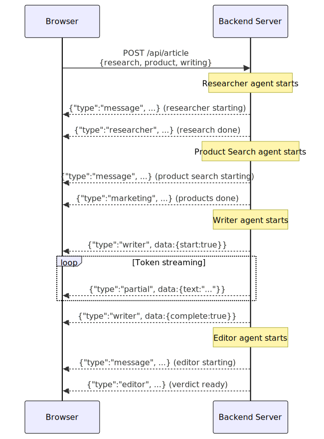

# Part 12: Building a Web UI for the Zava Creative Writer

> **Goal:** Add a browser-based front end to the Zava Creative Writer so you can watch the multi-agent pipeline run in real time, with live agent status badges and streamed article text, all served from a single local web server.

In [Part 7](part7-zava-creative-writer.md) you explored the Zava Creative Writer as a **CLI application** (JavaScript, C#) and a **headless API** (Python). In this lab you will connect a shared **vanilla HTML/CSS/JavaScript** front end to each backend so that users can interact with the pipeline through a browser rather than a terminal.

---

## What You Will Learn

| Objective | Description |
|-----------|-------------|
| Serve static files from a backend | Mount an HTML/CSS/JS directory alongside your API route |
| Consume streaming NDJSON in the browser | Use the Fetch API with `ReadableStream` to read newline-delimited JSON |
| Unified streaming protocol | Ensure Python, JavaScript, and C# backends emit the same message format |
| Progressive UI updates | Update agent status badges and stream article text token by token |
| Add an HTTP layer to a CLI app | Wrap existing orchestrator logic in an Express-style server (JS) or ASP.NET Core minimal API (C#) |

---

## Architecture

The UI is a single set of static files (`index.html`, `style.css`, `app.js`) shared by all three backends. Each backend exposes the same two routes:



| Route | Method | Purpose |
|-------|--------|---------|
| `/` | GET | Serves the static UI |
| `/api/article` | POST | Runs the multi-agent pipeline and streams NDJSON |

The front end sends a JSON body and reads the response as a stream of newline-delimited JSON messages. Each message has a `type` field that the UI uses to update the correct panel:

| Message type | Meaning |
|-------------|---------|
| `message` | Status update (e.g. "Starting researcher agent task...") |
| `researcher` | Research results are ready |
| `marketing` | Product search results are ready |
| `writer` | Writer started or finished (contains `{ start: true }` or `{ complete: true }`) |
| `partial` | A single streamed token from the Writer (contains `{ text: "..." }`) |
| `editor` | Editor verdict is ready |
| `error` | Something went wrong |





---

## Prerequisites

- Complete [Part 7: Zava Creative Writer](part7-zava-creative-writer.md)
- Foundry Local CLI installed and the `phi-3.5-mini` model downloaded
- A modern web browser (Chrome, Edge, Firefox, or Safari)

---

## The Shared UI

Before touching any backend code, take a moment to explore the front end that all three language tracks will use. The files live in `zava-creative-writer-local/ui/`:

| File | Purpose |
|------|---------|
| `index.html` | Page layout: input form, agent status badges, article output area, collapsible detail panels |
| `style.css` | Minimal styling with status-badge colour states (waiting, running, done, error) |
| `app.js` | Fetch call, `ReadableStream` line reader, and DOM update logic |

> **Tip:** Open `index.html` directly in your browser to preview the layout. Nothing will work yet because there is no backend, but you can see the structure.

### How the Stream Reader Works

The key function in `app.js` reads the response body chunk by chunk and splits on newline boundaries:

```javascript
async function readStream(response) {
  const reader = response.body.getReader();
  const decoder = new TextDecoder();
  let buffer = "";

  while (true) {
    const { done, value } = await reader.read();
    if (done) break;

    buffer += decoder.decode(value, { stream: true });
    const lines = buffer.split("\n");
    buffer = lines.pop(); // keep the incomplete trailing line

    for (const line of lines) {
      const trimmed = line.trim();
      if (!trimmed) continue;
      try {
        const msg = JSON.parse(trimmed);
        if (msg && msg.type) handleMessage(msg);
      } catch { /* skip non-JSON lines */ }
    }
  }
}
```

Each parsed message is dispatched to `handleMessage()`, which updates the relevant DOM element based on `msg.type`.

---

## Exercises

### Exercise 1: Run the Python Backend with the UI

The Python (FastAPI) variant already has a streaming API endpoint. The only change is mounting the `ui/` folder as static files.

**1.1** Navigate to the Python API directory and install dependencies:

```bash
cd zava-creative-writer-local/src/api
pip install -r requirements.txt
```

```powershell
cd zava-creative-writer-local\src\api
pip install -r requirements.txt
```

**1.2** Start the server:

```bash
uvicorn main:app --reload --port 8000
```

```powershell
uvicorn main:app --reload --port 8000
```

**1.3** Open your browser at `http://localhost:8000`. You should see the Zava Creative Writer UI with three text fields and a "Generate Article" button.

**1.4** Click **Generate Article** using the default values. Watch the agent status badges change from "Waiting" to "Running" to "Done" as each agent completes its work, and see the article text stream into the output panel token by token.

> **Troubleshooting:** If the page shows a JSON response instead of the UI, ensure you are running the updated `main.py` that mounts the static files. The `/api/article` endpoint still works at its original path; the static file mount serves the UI on every other route.

**How it works:** The updated `main.py` adds a single line at the bottom:

```python
app.mount("/", StaticFiles(directory=str(ui_dir), html=True), name="ui")
```

This serves every file from `zava-creative-writer-local/ui/` as a static asset, with `index.html` as the default document. The `/api/article` POST route is registered before the static mount, so it takes priority.

---

### Exercise 2: Add a Web Server to the JavaScript Variant

The JavaScript variant is currently a CLI application (`main.mjs`). A new file, `server.mjs`, wraps the same agent modules behind an HTTP server and serves the shared UI.

**2.1** Navigate to the JavaScript directory and install dependencies:

```bash
cd zava-creative-writer-local/src/javascript
npm install
```

```powershell
cd zava-creative-writer-local\src\javascript
npm install
```

**2.2** Start the web server:

```bash
node server.mjs
```

```powershell
node server.mjs
```

You should see:

```
Starting Foundry Local service...
Model already downloaded: phi-3.5-mini
Loading model: phi-3.5-mini...
Model ready: ...

Zava Creative Writer UI is running at http://localhost:3000
```

**2.3** Open `http://localhost:3000` in your browser and click **Generate Article**. The same UI works identically against the JavaScript backend.

**Study the code:** Open `server.mjs` and note the key patterns:

- **Static file serving** uses Node.js built-in `http`, `fs`, and `path` modules with no external framework required.
- **Path-traversal protection** normalises the requested path and verifies it stays within the `ui/` directory.
- **NDJSON streaming** uses a `sendLine()` helper that serialises each object, strips internal newlines, and appends a trailing newline.
- **Agent orchestration** reuses the existing `researcher.mjs`, `product.mjs`, `writer.mjs`, and `editor.mjs` modules unchanged.

<details>
<summary>Key excerpt from server.mjs</summary>

```javascript
function sendLine(res, obj) {
  res.write(JSON.stringify(obj).replace(/\n/g, "") + "\n");
}

// Researcher
sendLine(res, { type: "message", message: "Starting researcher agent task...", data: {} });
let researchResult = await research(researchContext, feedback);
sendLine(res, { type: "researcher", message: "Completed researcher task", data: researchResult });

// Writer (streaming)
for await (const token of write(...)) {
  sendLine(res, { type: "partial", message: "token", data: { text: token } });
}
```

</details>

---

### Exercise 3: Add a Minimal API to the C# Variant

The C# variant is currently a console application. A new project, `csharp-web`, uses ASP.NET Core minimal APIs to expose the same pipeline as a web service.

**3.1** Navigate to the C# web project and restore packages:

```bash
cd zava-creative-writer-local/src/csharp-web
dotnet restore
```

```powershell
cd zava-creative-writer-local\src\csharp-web
dotnet restore
```

**3.2** Run the web server:

```bash
dotnet run
```

```powershell
dotnet run
```

You should see:

```
Starting Foundry Local service...
Model already downloaded: phi-3.5-mini
Loading model: phi-3.5-mini...
Model ready: ...

Zava Creative Writer UI is running at http://localhost:5000
```

**3.3** Open `http://localhost:5000` in your browser and click **Generate Article**.

**Study the code:** Open `Program.cs` in the `csharp-web` directory and note:

- The project file uses `Microsoft.NET.Sdk.Web` instead of `Microsoft.NET.Sdk`, which adds ASP.NET Core support.
- Static files are served via `UseDefaultFiles` and `UseStaticFiles` pointed at the shared `ui/` directory.
- The `/api/article` endpoint writes NDJSON lines directly to `HttpContext.Response` and flushes after each line for real-time streaming.
- All agent logic (`RunResearcher`, `RunProductSearch`, `RunEditor`, `BuildWriterMessages`) is the same as the console version.

<details>
<summary>Key excerpt from csharp-web/Program.cs</summary>

```csharp
app.MapPost("/api/article", async (HttpContext ctx) =>
{
    ctx.Response.ContentType = "text/event-stream; charset=utf-8";

    async Task SendLine(object obj)
    {
        var json = JsonSerializer.Serialize(obj).Replace("\n", "") + "\n";
        await ctx.Response.WriteAsync(json);
        await ctx.Response.Body.FlushAsync();
    }

    // Researcher
    await SendLine(new { type = "message", message = "Starting researcher agent task...", data = new { } });
    var researchResult = RunResearcher(body.Research, feedback);
    await SendLine(new { type = "researcher", message = "Completed researcher task", data = (object)researchResult });

    // Writer (streaming)
    foreach (var update in completionUpdates)
    {
        if (update.ContentUpdate.Count > 0)
        {
            var text = update.ContentUpdate[0].Text;
            await SendLine(new { type = "partial", message = "token", data = new { text } });
        }
    }
});
```

</details>

---

### Exercise 4: Explore the Agent Status Badges

Now that you have a working UI, look at how the front end updates the status badges.

**4.1** Open `zava-creative-writer-local/ui/app.js` in your editor.

**4.2** Find the `handleMessage()` function. Notice how it maps message types to DOM updates:

| Message type | UI action |
|-------------|-----------|
| `message` containing "researcher" | Sets the Researcher badge to "Running" |
| `researcher` | Sets the Researcher badge to "Done" and populates the Research Results panel |
| `marketing` | Sets the Product Search badge to "Done" and populates the Product Matches panel |
| `writer` with `data.start` | Sets the Writer badge to "Running" and clears the article output |
| `partial` | Appends the token text to the article output |
| `writer` with `data.complete` | Sets the Writer badge to "Done" |
| `editor` | Sets the Editor badge to "Done" and populates the Editor Feedback panel |

**4.3** Open the collapsible "Research Results", "Product Matches", and "Editor Feedback" panels below the article to inspect the raw JSON each agent produced.

---

### Exercise 5: Customise the UI (Stretch)

Try one or more of these enhancements:

**5.1 Add a word count.** After the Writer finishes, display the article word count below the output panel. You can compute this in `handleMessage` when `type === "writer"` and `data.complete` is true:

```javascript
case "writer":
  if (data && data.complete) {
    setAgentState(statusWriter, "done");
    const words = articleOutput.textContent.trim().split(/\s+/).length;
    articleOutput.textContent += "\n\n[Word count: " + words + "]";
  }
  break;
```

**5.2 Add a retry indicator.** When the Editor requests a revision, the pipeline re-runs. Show a "Revision 1" or "Revision 2" banner in the status panel. Listen for a `message` type containing "Revision" and update a new DOM element.

**5.3 Dark mode.** Add a toggle button and a `.dark` class to the `<body>`. Override background, text, and panel colours in `style.css` with a `body.dark` selector.

---

## Summary

| What you did | How |
|-------------|-----|
| Served the UI from the Python backend | Mounted the `ui/` folder with `StaticFiles` in FastAPI |
| Added an HTTP server to the JavaScript variant | Created `server.mjs` using built-in Node.js `http` module |
| Added a web API to the C# variant | Created a new `csharp-web` project with ASP.NET Core minimal APIs |
| Consumed streaming NDJSON in the browser | Used `fetch()` with `ReadableStream` and line-by-line JSON parsing |
| Updated the UI in real time | Mapped message types to DOM updates (badges, text, collapsible panels) |

---

## Key Takeaways

1. A **shared static front end** can work with any backend that speaks the same streaming protocol, reinforcing the value of the OpenAI-compatible API pattern.
2. **Newline-delimited JSON (NDJSON)** is a straightforward streaming format that works natively with the browser `ReadableStream` API.
3. The **Python variant** needed the least change because it already had a FastAPI endpoint; the JavaScript and C# variants needed a thin HTTP wrapper.
4. Keeping the UI as **vanilla HTML/CSS/JS** avoids build tools, framework dependencies, and additional complexity for workshop learners.
5. The same agent modules (Researcher, Product, Writer, Editor) are reused without modification; only the transport layer changes.

---

## Further Reading

| Resource | Link |
|----------|------|
| MDN: Using Readable Streams | [developer.mozilla.org/en-US/docs/Web/API/ReadableStream](https://developer.mozilla.org/en-US/docs/Web/API/ReadableStream) |
| FastAPI Static Files | [fastapi.tiangolo.com/tutorial/static-files](https://fastapi.tiangolo.com/tutorial/static-files/) |
| ASP.NET Core Static Files | [learn.microsoft.com/en-us/aspnet/core/fundamentals/static-files](https://learn.microsoft.com/en-us/aspnet/core/fundamentals/static-files) |
| NDJSON Specification | [ndjson.org](https://ndjson.org) |
| Foundry Local | [foundrylocal.ai](https://foundrylocal.ai) |

---

Continue to [Part 13: Workshop Complete](part13-workshop-complete.md) for a summary of everything you have built throughout this workshop.

---

[← Part 11: Tool Calling](part11-tool-calling.md) | [Part 13: Workshop Complete →](part13-workshop-complete.md)
