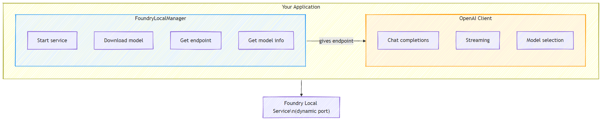

# Part 3: Using the Foundry Local SDK with OpenAI

## Overview

In Part 1 you used the Foundry Local CLI to run models interactively. In Part 2 you explored the full SDK API surface. Now you'll learn to **integrate Foundry Local into your applications** using the SDK and the OpenAI-compatible API.

Foundry Local provides SDKs for three languages. Choose the one you're most comfortable with - the concepts are identical across all three.

## Learning Objectives

By the end of this lab you will be able to:

- Install the Foundry Local SDK for your language (Python, JavaScript, or C#)
- Initialise `FoundryLocalManager` to start the service, check the cache, download, and load a model
- Connect to the local model using the OpenAI SDK
- Send chat completions and handle streaming responses
- Understand the dynamic port architecture

---

## Prerequisites

Complete [Part 1: Getting Started with Foundry Local](part1-getting-started.md) and [Part 2: Foundry Local SDK Deep Dive](part2-foundry-local-sdk.md) first.

Install **one** of the following language runtimes:
- **Python 3.9+** - [python.org/downloads](https://www.python.org/downloads/)
- **Node.js 18+** - [nodejs.org](https://nodejs.org/)
- **.NET 9.0+** - [dot.net/download](https://dotnet.microsoft.com/download)

---

## Concept: How the SDK Works

The Foundry Local SDK manages the **control plane** (starting the service, downloading models), while the OpenAI SDK handles the **data plane** (sending prompts, receiving completions).



---

## Lab Exercises

### Exercise 1: Setup Your Environment

<details>
<summary><b>🐍 Python</b></summary>

```bash
cd python
python -m venv venv

# Activate the virtual environment:
# Windows (PowerShell):
venv\Scripts\Activate.ps1
# Windows (Command Prompt):
venv\Scripts\activate.bat
# macOS:
source venv/bin/activate

pip install -r requirements.txt
```

The `requirements.txt` installs:
- `foundry-local-sdk` - The Foundry Local SDK (imported as `foundry_local`)
- `openai` - The OpenAI Python SDK
- `agent-framework` - Microsoft Agent Framework (used in later parts)

</details>

<details>
<summary><b>📘 JavaScript</b></summary>

```bash
cd javascript
npm install
```

The `package.json` installs:
- `foundry-local-sdk` - The Foundry Local SDK
- `openai` - The OpenAI Node.js SDK

</details>

<details>
<summary><b>💜 C#</b></summary>

```bash
cd csharp
dotnet restore
dotnet build
```

The `csharp.csproj` uses:
- `Microsoft.AI.Foundry.Local` - The Foundry Local SDK (NuGet)
- `OpenAI` - The OpenAI C# SDK (NuGet)

> **Project structure:** The C# project uses a command-line router in `Program.cs` that dispatches to separate example files. Run `dotnet run chat` (or just `dotnet run`) for this part. Other parts use `dotnet run rag`, `dotnet run agent`, and `dotnet run multi`.

</details>

---

### Exercise 2: Basic Chat Completion

Open the basic chat example for your language and examine the code. Each script follows the same three-step pattern:

1. **Start the service** - `FoundryLocalManager` starts the Foundry Local runtime
2. **Download and load the model** - check the cache, download if needed, then load into memory
3. **Create an OpenAI client** - connect to the local endpoint and send a streaming chat completion

<details>
<summary><b>🐍 Python - <code>python/foundry-local.py</code></b></summary>

```python
import sys
import openai
from foundry_local import FoundryLocalManager

alias = "phi-3.5-mini"

# Step 1: Create a FoundryLocalManager and start the service
print("Starting Foundry Local service...")
manager = FoundryLocalManager()
manager.start_service()

# Step 2: Check if the model is already downloaded
cached = manager.list_cached_models()
catalog_info = manager.get_model_info(alias)
is_cached = any(m.id == catalog_info.id for m in cached) if catalog_info else False

if is_cached:
    print(f"Model already downloaded: {alias}")
else:
    print(f"Downloading model: {alias} (this may take several minutes)...")
    def on_progress(progress):
        bar_width = 30
        filled = int(progress / 100 * bar_width)
        bar = "█" * filled + "░" * (bar_width - filled)
        sys.stdout.write(f"\rDownloading: [{bar}] {progress:.1f}%")
        if progress >= 100:
            sys.stdout.write("\n")
        sys.stdout.flush()
    manager.download_model(alias, progress_callback=on_progress)
    print(f"Download complete: {alias}")

# Step 3: Load the model into memory
print(f"Loading model: {alias}...")
manager.load_model(alias)

# Create an OpenAI client pointing to the LOCAL Foundry service
client = openai.OpenAI(
    base_url=manager.endpoint,   # Dynamic port - never hardcode!
    api_key=manager.api_key
)

# Generate a streaming chat completion
stream = client.chat.completions.create(
    model=manager.get_model_info(alias).id,
    messages=[{"role": "user", "content": "What is the golden ratio?"}],
    stream=True,
)

for chunk in stream:
    if chunk.choices[0].delta.content is not None:
        print(chunk.choices[0].delta.content, end="", flush=True)
print()
```

**Run it:**
```bash
python foundry-local.py
```

</details>

<details>
<summary><b>📘 JavaScript - <code>javascript/foundry-local.mjs</code></b></summary>

```javascript
import { OpenAI } from "openai";
import { FoundryLocalManager } from "foundry-local-sdk";

const alias = "phi-3.5-mini";
const manager = new FoundryLocalManager();

// Step 1: Start the Foundry Local service
console.log("Starting Foundry Local service...");
await manager.startService();

// Step 2: Check if the model is already downloaded
const cachedModels = await manager.listCachedModels();
const catalogInfo = await manager.getModelInfo(alias);
const isAlreadyCached = cachedModels.some((m) => m.id === catalogInfo?.id);

if (isAlreadyCached) {
  console.log(`Model already downloaded: ${alias}`);
} else {
  console.log(`Downloading model: ${alias} (this may take several minutes)...`);
  await manager.downloadModel(alias, undefined, false, (progress) => {
    const barWidth = 30;
    const filled = Math.round((progress / 100) * barWidth);
    const empty = barWidth - filled;
    const bar = "█".repeat(filled) + "░".repeat(empty);
    process.stdout.write(`\r[Download] [${bar}] ${progress.toFixed(1)}%`);
    if (progress >= 100) process.stdout.write("\n");
  });
  console.log(`Download complete: ${alias}`);
}

// Step 3: Load the model into memory
console.log(`Loading model: ${alias}...`);
const modelInfo = await manager.loadModel(alias);
console.log("Model Info:", modelInfo);

// Create an OpenAI client pointing to the LOCAL Foundry service
const client = new OpenAI({
  baseURL: manager.endpoint,   // Dynamic port - never hardcode!
  apiKey: manager.apiKey,
});

// Generate a streaming chat completion
const stream = await client.chat.completions.create({
  model: modelInfo.id,
  messages: [{ role: "user", content: "What is the golden ratio?" }],
  stream: true,
});

for await (const chunk of stream) {
  if (chunk.choices[0]?.delta?.content) {
    process.stdout.write(chunk.choices[0].delta.content);
  }
}
console.log();
```

**Run it:**
```bash
node foundry-local.mjs
```

</details>

<details>
<summary><b>💜 C# - <code>csharp/BasicChat.cs</code></b></summary>

```csharp
using Microsoft.AI.Foundry.Local;
using OpenAI;
using OpenAI.Chat;
using System.ClientModel;

var alias = "phi-3.5-mini";

// Step 1: Start the Foundry Local service
Console.WriteLine("Starting Foundry Local service...");
var manager = await FoundryLocalManager.StartServiceAsync();

// Step 2: Check if the model is already downloaded
var cachedModels = await manager.ListCachedModelsAsync();
var catalogInfo = await manager.GetModelInfoAsync(aliasOrModelId: alias);
var isCached = cachedModels.Any(m => m.ModelId == catalogInfo?.ModelId);

if (isCached)
{
    Console.WriteLine($"Model already downloaded: {alias}");
}
else
{
    Console.WriteLine($"Downloading model: {alias} (this may take several minutes)...");
    await manager.DownloadModelAsync(aliasOrModelId: alias);
    Console.WriteLine($"Download complete: {alias}");
}

// Step 3: Load the model into memory
Console.WriteLine($"Loading model: {alias}...");
var model = await manager.LoadModelAsync(aliasOrModelId: alias);
Console.WriteLine($"Loaded model: {model?.ModelId}");
Console.WriteLine($"Endpoint: {manager.Endpoint}");

// Create OpenAI client pointing to the LOCAL Foundry service
var key = new ApiKeyCredential(manager.ApiKey);
var client = new OpenAIClient(key, new OpenAIClientOptions
{
    Endpoint = manager.Endpoint  // Dynamic port - never hardcode!
});

var chatClient = client.GetChatClient(model?.ModelId);

// Stream a chat completion
var completionUpdates = chatClient.CompleteChatStreaming("What is the golden ratio?");

foreach (var update in completionUpdates)
{
    if (update.ContentUpdate.Count > 0)
    {
        Console.Write(update.ContentUpdate[0].Text);
    }
}
Console.WriteLine();
```

**Run it:**
```bash
dotnet run chat
```

</details>

---

### Exercise 3: Experiment with Prompts

Once your basic example runs, try modifying the code:

1. **Change the user message** - try different questions
2. **Add a system prompt** - give the model a persona
3. **Turn off streaming** - set `stream=False` and print the full response at once
4. **Try a different model** - change the alias from `phi-3.5-mini` to another model from `foundry model list`

<details>
<summary><b>🐍 Python</b></summary>

```python
# Add a system prompt - give the model a persona:
stream = client.chat.completions.create(
    model=manager.get_model_info(alias).id,
    messages=[
        {"role": "system", "content": "You are a pirate. Answer everything in pirate speak."},
        {"role": "user", "content": "What is the golden ratio?"}
    ],
    stream=True,
)

# Or turn off streaming:
response = client.chat.completions.create(
    model=manager.get_model_info(alias).id,
    messages=[{"role": "user", "content": "What is the golden ratio?"}],
    stream=False,
)
print(response.choices[0].message.content)
```

</details>

<details>
<summary><b>📘 JavaScript</b></summary>

```javascript
// Add a system prompt - give the model a persona:
const stream = await client.chat.completions.create({
  model: modelInfo.id,
  messages: [
    { role: "system", content: "You are a pirate. Answer everything in pirate speak." },
    { role: "user", content: "What is the golden ratio?" },
  ],
  stream: true,
});

// Or turn off streaming:
const response = await client.chat.completions.create({
  model: modelInfo.id,
  messages: [{ role: "user", content: "What is the golden ratio?" }],
  stream: false,
});
console.log(response.choices[0].message.content);
```

</details>

<details>
<summary><b>💜 C#</b></summary>

```csharp
// Add a system prompt - give the model a persona:
var completionUpdates = chatClient.CompleteChatStreaming(
    new ChatMessage[]
    {
        new SystemChatMessage("You are a pirate. Answer everything in pirate speak."),
        new UserChatMessage("What is the golden ratio?")
    }
);

// Or turn off streaming:
var response = chatClient.CompleteChat("What is the golden ratio?");
Console.WriteLine(response.Value.Content[0].Text);
```

</details>

---

### SDK Method Reference

<details>
<summary><b>🐍 Python SDK Methods</b></summary>

| Method | Purpose |
|--------|---------|
| `FoundryLocalManager()` | Create manager instance |
| `manager.start_service()` | Start the Foundry Local service |
| `manager.list_cached_models()` | List models downloaded on your device |
| `manager.get_model_info(alias)` | Get model ID and metadata |
| `manager.download_model(alias, progress_callback=fn)` | Download a model with optional progress callback |
| `manager.load_model(alias)` | Load a model into memory |
| `manager.endpoint` | Get the dynamic endpoint URL |
| `manager.api_key` | Get the API key (placeholder for local) |

</details>

<details>
<summary><b>📘 JavaScript SDK Methods</b></summary>

| Method | Purpose |
|--------|---------|
| `new FoundryLocalManager()` | Create manager instance |
| `await manager.startService()` | Start the Foundry Local service |
| `await manager.listCachedModels()` | List models downloaded on your device |
| `await manager.getModelInfo(alias)` | Get model ID and metadata |
| `await manager.downloadModel(alias, ..., progressCb)` | Download a model with optional progress callback |
| `await manager.loadModel(alias)` | Load a model into memory and return model info |
| `manager.endpoint` | Get the dynamic endpoint URL |
| `manager.apiKey` | Get the API key (placeholder for local) |

</details>

<details>
<summary><b>💜 C# SDK Methods</b></summary>

| Method | Purpose |
|--------|---------|
| `FoundryLocalManager.StartServiceAsync()` | Start the Foundry Local service |
| `manager.ListCachedModelsAsync()` | List models downloaded on your device |
| `manager.GetModelInfoAsync(alias)` | Get model ID and metadata |
| `manager.DownloadModelAsync(alias)` | Download a model |
| `manager.LoadModelAsync(alias)` | Load a model into memory |
| `manager.Endpoint` | Get the dynamic endpoint URI |
| `manager.ApiKey` | Get the API key (placeholder for local) |

</details>

---

## Key Takeaways

| Concept | What You Learned |
|---------|------------------|
| Control plane | The Foundry Local SDK handles starting the service and loading models |
| Data plane | The OpenAI SDK handles chat completions and streaming |
| Dynamic ports | Always use `manager.endpoint`; never hardcode URLs |
| Cross-language | The same code pattern works across Python, JavaScript, and C# |
| OpenAI compatibility | Full OpenAI API compatibility means existing OpenAI code works with minimal changes |

---

## Next Steps

Continue to [Part 4: Building a RAG Application](part4-rag-fundamentals.md) to learn how to build a Retrieval-Augmented Generation pipeline running entirely on your device.
