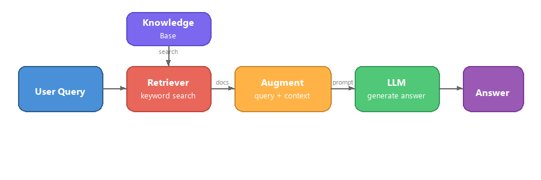

# Part 4: Building a RAG Application with Foundry Local

## Overview

Large Language Models are powerful, but they only know what was in their training data. **Retrieval-Augmented Generation (RAG)** solves this by giving the model relevant context at query time - pulled from your own documents, databases, or knowledge bases.

In this lab you will build a complete RAG pipeline that runs **entirely on your device** using Foundry Local. No cloud services, no vector databases, no embeddings API - just local retrieval and a local model.

## Learning Objectives

By the end of this lab you will be able to:

- Explain what RAG is and why it matters for AI applications
- Build a local knowledge base from text documents
- Implement a simple retrieval function to find relevant context
- Compose a system prompt that grounds the model on retrieved facts
- Run the full Retrieve → Augment → Generate pipeline on-device
- Understand the trade-offs between simple keyword retrieval and vector search

---

## Prerequisites

- Complete [Part 3: Using the Foundry Local SDK with OpenAI](part3-sdk-and-apis.md)
- Foundry Local CLI installed and `phi-3.5-mini` model downloaded

---

## Concept: What is RAG?

Without RAG, an LLM can only answer from its training data - which may be outdated, incomplete, or missing your private information:

```
User: "What is Zava's return policy?"
LLM:  "I do not have information about Zava's return policy."  ← No context!
```

With RAG, you **retrieve** relevant documents first, then **augment** the prompt with that context before **generating** a response:



The key insight: **the model does not need to "know" the answer; it just needs to read the right documents.**

---

## Lab Exercises

### Exercise 1: Understand the Knowledge Base

Open the RAG example for your language and examine the knowledge base:

<details>
<summary><b>🐍 Python: <code>python/foundry-local-rag.py</code></b></summary>

The knowledge base is a simple list of dictionaries with `title` and `content` fields:

```python
KNOWLEDGE_BASE = [
    {
        "title": "Foundry Local Overview",
        "content": (
            "Foundry Local brings the power of Azure AI Foundry to your local "
            "device without requiring an Azure subscription..."
        ),
    },
    {
        "title": "Supported Hardware",
        "content": (
            "Foundry Local automatically selects the best model variant for "
            "your hardware. If you have an Nvidia CUDA GPU it downloads the "
            "CUDA-optimized model..."
        ),
    },
    # ... more entries
]
```

Each entry represents a "chunk" of knowledge - a focused piece of information on one topic.

</details>

<details>
<summary><b>📘 JavaScript: <code>javascript/foundry-local-rag.mjs</code></b></summary>

The knowledge base uses the same structure as an array of objects:

```javascript
const KNOWLEDGE_BASE = [
  {
    title: "Foundry Local Overview",
    content:
      "Foundry Local brings the power of Azure AI Foundry to your local " +
      "device without requiring an Azure subscription...",
  },
  {
    title: "Supported Hardware",
    content:
      "Foundry Local automatically selects the best model variant for " +
      "your hardware...",
  },
  // ... more entries
];
```

</details>

<details>
<summary><b>💜 C#: <code>csharp/RagPipeline.cs</code></b></summary>

The knowledge base uses a list of named tuples:

```csharp
private static readonly List<(string Title, string Content)> KnowledgeBase =
[
    ("Foundry Local Overview",
     "Foundry Local brings the power of Azure AI Foundry to your local " +
     "device without requiring an Azure subscription..."),

    ("Supported Hardware",
     "Foundry Local automatically selects the best model variant for " +
     "your hardware..."),

    // ... more entries
];
```

</details>

> **In a real application**, the knowledge base would come from files on disk, a database, a search index, or an API. For this lab, we use an in-memory list to keep things simple.

---

### Exercise 2: Understand the Retrieval Function

The retrieval step finds the most relevant chunks for a user's question. This example uses **keyword overlap** - counting how many words in the query also appear in each chunk:

<details>
<summary><b>🐍 Python</b></summary>

```python
def retrieve(query: str, top_k: int = 2) -> list[dict]:
    """Return the top-k knowledge chunks most relevant to the query."""
    query_words = set(query.lower().split())
    scored = []
    for chunk in KNOWLEDGE_BASE:
        chunk_words = set(chunk["content"].lower().split())
        overlap = len(query_words & chunk_words)
        scored.append((overlap, chunk))
    scored.sort(key=lambda x: x[0], reverse=True)
    return [item[1] for item in scored[:top_k]]
```

</details>

<details>
<summary><b>📘 JavaScript</b></summary>

```javascript
function retrieve(query, topK = 2) {
  const queryWords = new Set(query.toLowerCase().split(/\s+/));
  const scored = KNOWLEDGE_BASE.map((chunk) => {
    const chunkWords = new Set(chunk.content.toLowerCase().split(/\s+/));
    let overlap = 0;
    for (const w of queryWords) {
      if (chunkWords.has(w)) overlap++;
    }
    return { overlap, chunk };
  });
  scored.sort((a, b) => b.overlap - a.overlap);
  return scored.slice(0, topK).map((s) => s.chunk);
}
```

</details>

<details>
<summary><b>💜 C#</b></summary>

```csharp
private static List<(string Title, string Content)> Retrieve(string query, int topK = 2)
{
    var queryWords = new HashSet<string>(
        query.ToLowerInvariant().Split(' ', StringSplitOptions.RemoveEmptyEntries));

    return KnowledgeBase
        .Select(chunk =>
        {
            var chunkWords = new HashSet<string>(
                chunk.Content.ToLowerInvariant().Split(' ', StringSplitOptions.RemoveEmptyEntries));
            var overlap = queryWords.Intersect(chunkWords).Count();
            return (Overlap: overlap, Chunk: chunk);
        })
        .OrderByDescending(x => x.Overlap)
        .Take(topK)
        .Select(x => x.Chunk)
        .ToList();
}
```

</details>

**How it works:**
1. Split the query into individual words
2. For each knowledge chunk, count how many query words appear in that chunk
3. Sort by overlap score (highest first)
4. Return the top-k most relevant chunks

> **Trade-off:** Keyword overlap is simple but limited; it does not understand synonyms or meaning. Production RAG systems typically use **embedding vectors** and a **vector database** for semantic search. However, keyword overlap is a great starting point and requires no extra dependencies.

---

### Exercise 3: Understand the Augmented Prompt

The retrieved context is injected into the **system prompt** before sending it to the model:

```python
system_prompt = (
    "You are a helpful assistant. Answer the user's question using ONLY "
    "the information provided in the context below. If the context does "
    "not contain enough information, say so.\n\n"
    f"Context:\n{context_text}"
)
```

Key design decisions:
- **"ONLY the information provided"** - prevents the model from hallucinating facts not in the context
- **"If the context does not contain enough information, say so"** - encourages honest "I do not know" answers
- The context is placed in the system message so it shapes all responses

---

### Exercise 4: Run the RAG Pipeline

Run the complete example:

**Python:**
```bash
cd python
python foundry-local-rag.py
```

**JavaScript:**
```bash
cd javascript
node foundry-local-rag.mjs
```

**C#:**
```bash
cd csharp
dotnet run rag
```

You should see three things printed:
1. **The question** being asked
2. **The retrieved context** - the chunks selected from the knowledge base
3. **The answer** - generated by the model using only that context

Example output:
```
Question: How do I install Foundry Local and what hardware does it support?

--- Retrieved Context ---
### Installation
On Windows install Foundry Local with: winget install Microsoft.FoundryLocal...

### Supported Hardware
Foundry Local automatically selects the best model variant for your hardware...
-------------------------

Answer: To install Foundry Local, you can use the following methods depending
on your operating system: On Windows, run `winget install Microsoft.FoundryLocal`.
On macOS, use `brew install microsoft/foundrylocal/foundrylocal`...
```

Notice how the model's answer is **grounded** in the retrieved context - it only mentions facts from the knowledge base documents.

---

### Exercise 5: Experiment and Extend

Try these modifications to deepen your understanding:

1. **Change the question** - ask something that IS in the knowledge base versus something that IS NOT:
   ```python
   question = "What programming languages does Foundry Local support?"  # ← In context
   question = "How much does Foundry Local cost?"                       # ← Not in context
   ```
   Does the model correctly say "I do not know" when the answer is not in the context?

2. **Add a new knowledge chunk** - append a new entry to `KNOWLEDGE_BASE`:
   ```python
   {
       "title": "Pricing",
       "content": "Foundry Local is completely free and open source under the MIT license.",
   }
   ```
   Now ask the pricing question again.

3. **Change `top_k`** - retrieve more or fewer chunks:
   ```python
   context_chunks = retrieve(question, top_k=3)  # More context
   context_chunks = retrieve(question, top_k=1)  # Less context
   ```
   How does the amount of context affect the answer quality?

4. **Remove the grounding instruction** - change the system prompt to just "You are a helpful assistant." and see if the model starts hallucinating facts.

---

## Deep Dive: Optimizing RAG for On-Device Performance

Running RAG on-device introduces constraints you do not face in the cloud: limited RAM, no dedicated GPU (CPU/NPU execution), and a small model context window. The design decisions below directly address these constraints and are based on patterns from production-style local RAG applications built with Foundry Local.

### Chunking Strategy: Fixed-Size Sliding Window

Chunking - how you split documents into pieces - is one of the most impactful decisions in any RAG system. For on-device scenarios, a **fixed-size sliding window with overlap** is the recommended starting point:

| Parameter | Recommended Value | Why |
|-----------|------------------|-----|
| **Chunk size** | ~200 tokens | Keeps retrieved context compact, leaving room in Phi-3.5 Mini's context window for the system prompt, conversation history, and generated output |
| **Overlap** | ~25 tokens (12.5%) | Prevents information loss at chunk boundaries - important for procedures and step-by-step instructions |
| **Tokenization** | Whitespace split | Zero dependencies, no tokenizer library needed. All compute budget stays with the LLM |

The overlap works like a sliding window: each new chunk starts 25 tokens before the previous one ended, so sentences that span chunk boundaries appear in both chunks.

> **Why not other strategies?**
> - **Sentence-based splitting** produces unpredictable chunk sizes; some safety procedures are single long sentences that would not split well
> - **Section-aware splitting** (on `##` headings) creates wildly different chunk sizes - some too small, others too large for the model's context window
> - **Semantic chunking** (embedding-based topic detection) gives the best retrieval quality, but requires a second model in memory alongside Phi-3.5 Mini - risky on hardware with 8-16 GB shared memory

### Stepping Up Retrieval: TF-IDF Vectors

The keyword overlap approach in this lab works, but if you want better retrieval without adding an embedding model, **TF-IDF (Term Frequency-Inverse Document Frequency)** is an excellent middle ground:

```
Keyword Overlap  →  TF-IDF Vectors  →  Embedding Models
    (this lab)     (lightweight upgrade)   (production)
  Simple & fast    Better ranking,         Best quality,
  No dependencies  still no ML model       requires embedding model
  ~Basic matching  ~1ms retrieval          ~100-500ms per query
```

TF-IDF converts each chunk into a numeric vector based on how important each word is within that chunk *relative to all chunks*. At query time, the question is vectorized the same way and compared using cosine similarity. You can implement this with SQLite and pure JavaScript/Python - no vector database, no embedding API.

> **Performance:** TF-IDF cosine similarity over fixed-size chunks typically achieves **~1ms retrieval**, compared to ~100-500ms when an embedding model encodes each query. All 20+ documents can be chunked and indexed in under a second.

### Edge/Compact Mode for Constrained Devices

When running on very constrained hardware (older laptops, tablets, field devices), you can reduce resource usage by shrinking three knobs:

| Setting | Standard Mode | Edge/Compact Mode |
|---------|--------------|-------------------|
| **System prompt** | ~300 tokens | ~80 tokens |
| **Max output tokens** | 1024 | 512 |
| **Retrieved chunks (top-k)** | 5 | 3 |

Fewer retrieved chunks means less context for the model to process, which reduces latency and memory pressure. A shorter system prompt frees more of the context window for the actual answer. This trade-off is worth it on devices where every token of context window counts.

### Single Model in Memory

One of the most important principles for on-device RAG: **keep only one model loaded**. If you use an embedding model for retrieval *and* a language model for generation, you are splitting limited NPU/RAM resources between two models. Lightweight retrieval (keyword overlap, TF-IDF) avoids this entirely:

- No embedding model competing with the LLM for memory
- Faster cold start - only one model to load
- Predictable memory usage - the LLM gets all available resources
- Works on machines with as little as 8 GB RAM

### SQLite as a Local Vector Store

For small-to-medium document collections (hundreds to low thousands of chunks), **SQLite is fast enough** for brute-force cosine similarity search and adds zero infrastructure:

- Single `.db` file on disk - no server process, no configuration
- Ships with every major language runtime (Python `sqlite3`, Node.js `better-sqlite3`, .NET `Microsoft.Data.Sqlite`)
- Stores document chunks alongside their TF-IDF vectors in one table
- No need for Pinecone, Qdrant, Chroma, or FAISS at this scale

### Performance Summary

These design choices combine to deliver responsive RAG on consumer hardware:

| Metric | On-Device Performance |
|--------|----------------------|
| **Retrieval latency** | ~1ms (TF-IDF) to ~5ms (keyword overlap) |
| **Ingestion speed** | 20 documents chunked and indexed in < 1 second |
| **Models in memory** | 1 (LLM only - no embedding model) |
| **Storage overhead** | < 1 MB for chunks + vectors in SQLite |
| **Cold start** | Single model load, no embedding runtime startup |
| **Hardware floor** | 8 GB RAM, CPU-only (no GPU required) |

> **When to upgrade:** If you scale to hundreds of long documents, mixed content types (tables, code, prose), or need semantic understanding of queries, consider adding an embedding model and switching to vector similarity search. For most on-device use cases with focused document sets, TF-IDF + SQLite delivers excellent results with minimal resource usage.

---

## Key Concepts

| Concept | Description |
|---------|-------------|
| **Retrieval** | Finding relevant documents from a knowledge base based on the user's query |
| **Augmentation** | Inserting retrieved documents into the prompt as context |
| **Generation** | The LLM produces an answer grounded in the provided context |
| **Chunking** | Breaking large documents into smaller, focused pieces |
| **Grounding** | Constraining the model to only use provided context (reduces hallucination) |
| **Top-k** | The number of most-relevant chunks to retrieve |

---

## RAG in Production vs. This Lab

| Aspect | This Lab | On-Device optimised | Cloud Production |
|--------|----------|--------------------|-----------------|
| **Knowledge base** | In-memory list | Files on disk, SQLite | Database, search index |
| **Retrieval** | Keyword overlap | TF-IDF + cosine similarity | Vector embeddings + similarity search |
| **Embeddings** | None needed | None - TF-IDF vectors | Embedding model (local or cloud) |
| **Vector store** | None needed | SQLite (single `.db` file) | FAISS, Chroma, Azure AI Search, etc. |
| **Chunking** | Manual | Fixed-size sliding window (~200 tokens, 25-token overlap) | Semantic or recursive chunking |
| **Models in memory** | 1 (LLM) | 1 (LLM) | 2+ (embedding + LLM) |
| **Retrieval latency** | ~5ms | ~1ms | ~100-500ms |
| **Scale** | 5 documents | Hundreds of documents | Millions of documents |

The patterns you learn here (retrieve, augment, generate) are the same at any scale. The retrieval method improves, but the overall architecture stays identical. The middle column shows what is achievable on-device with lightweight techniques, often the sweet spot for local applications where you trade cloud-scale for privacy, offline capability, and zero latency to external services.

---

## Key Takeaways

| Concept | What You Learned |
|---------|------------------|
| RAG pattern | Retrieve + Augment + Generate: give the model the right context and it can answer questions about your data |
| On-device | Everything runs locally with no cloud APIs or vector database subscriptions |
| Grounding instructions | System prompt constraints are critical to prevent hallucination |
| Keyword overlap | A simple but effective starting point for retrieval |
| TF-IDF + SQLite | A lightweight upgrade path that keeps retrieval under 1ms with no embedding model |
| One model in memory | Avoid loading an embedding model alongside the LLM on constrained hardware |
| Chunk size | Roughly 200 tokens with overlap balances retrieval precision and context window efficiency |
| Edge/compact mode | Use fewer chunks and shorter prompts for very constrained devices |
| Universal pattern | The same RAG architecture works for any data source: documents, databases, APIs, or wikis |

> **Want to see a full on-device RAG application?** Check out [Gas Field Local RAG](https://github.com/leestott/local-rag), a production-style offline RAG agent built with Foundry Local and Phi-3.5 Mini that demonstrates these optimisation patterns with a real-world document set.

---

## Next Steps

Continue to [Part 5: Building AI Agents](part5-single-agents.md) to learn how to build intelligent agents with personas, instructions, and multi-turn conversations using the Microsoft Agent Framework.
