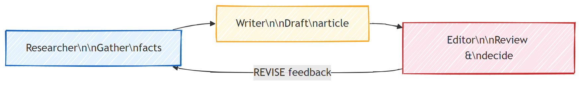
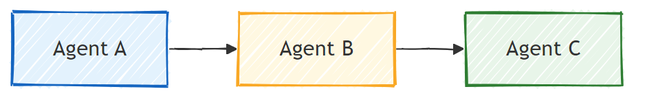
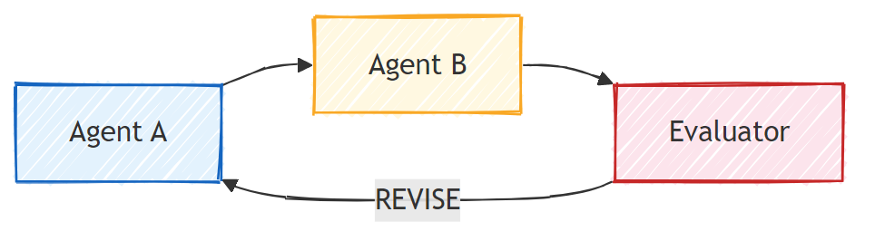
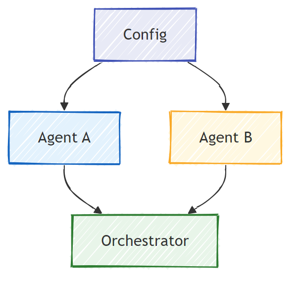

# Part 5: Multi-Agent Workflows

> **Goal:** Combine multiple specialized agents into coordinated pipelines that divide complex tasks among collaborating agents — all running locally with Foundry Local.

## Why Multi-Agent?

A single agent can handle many tasks, but complex workflows benefit from **specialization**. Instead of one agent trying to research, write, and edit simultaneously, you break the work into focused roles:



| Pattern | Description |
|---------|-------------|
| **Sequential** | Output of Agent A feeds into Agent B → Agent C |
| **Feedback loop** | An evaluator agent can send work back for revision |
| **Shared context** | All agents use the same model/endpoint, but different instructions |
| **Typed output** | Agents produce structured results (JSON) for reliable hand-offs |

---

## Exercises

### Exercise 1 — Run the Multi-Agent Pipeline

The workshop includes a complete Researcher → Writer → Editor workflow.

<details>
<summary><strong>🐍 Python</strong></summary>

**Setup:**
```bash
cd python
pip install -r requirements.txt
```

**Run:**
```bash
python foundry-local-multi-agent.py
```

**What happens:**
1. **Researcher** receives a topic and returns bullet-point facts
2. **Writer** takes the research and drafts a blog post (3-4 paragraphs)
3. **Editor** reviews the article for quality and returns ACCEPT or REVISE

</details>

<details>
<summary><strong>📦 JavaScript</strong></summary>

**Setup:**
```bash
cd javascript
npm install
```

**Run:**
```bash
node foundry-local-multi-agent.mjs
```

**Same three-stage pipeline** — Researcher → Writer → Editor.

</details>

<details>
<summary><strong>💜 C#</strong></summary>

**Setup:**
```bash
cd csharp
dotnet restore
```

**Run:**
```bash
dotnet run multi
```

**Same three-stage pipeline** — Researcher → Writer → Editor.

</details>

---

### Exercise 2 — Anatomy of the Pipeline

Study how agents are defined and connected:

**1. Shared model client**

All agents share the same Foundry Local model:

```python
# Python
chat_client = OpenAIChatClient(
    model_id=model_info.id,
    base_url=manager.endpoint,
    api_key=manager.api_key,
)
```

```javascript
// JavaScript
const client = new OpenAI({
  baseURL: manager.endpoint,
  apiKey: manager.apiKey,
});
```

```csharp
// C#
var key = new ApiKeyCredential(manager.ApiKey);
var client = new OpenAIClient(key, new OpenAIClientOptions
{
    Endpoint = manager.Endpoint
});
var chatClient = client.GetChatClient(model?.ModelId);
```

**2. Specialized instructions**

Each agent has a distinct persona:

| Agent | Instructions (summary) |
|-------|----------------------|
| Researcher | "Provide key facts, statistics, and background. Organize as bullet points." |
| Writer | "Write an engaging blog post (3-4 paragraphs) from the research notes. Don't invent facts." |
| Editor | "Review for clarity, grammar, and factual consistency. Verdict: ACCEPT or REVISE." |

**3. Data flows between agents**

```python
# Step 1 — output from researcher becomes input to writer
research_result = await researcher.run(f"Research: {topic}")

# Step 2 — output from writer becomes input to editor
writer_result = await writer.run(f"Write using:\n{research_result.text}")

# Step 3 — editor reviews both research and article
editor_result = await editor.run(
    f"Research:\n{research_result.text}\n\nArticle:\n{writer_result.text}"
)
```

```csharp
// C# — same pattern, synchronous calls
var researchNotes = researcher.Run(
    $"Research the following topic and provide key facts:\n{topic}");

var draft = writer.Run(
    $"Write a blog post based on these research notes:\n\n{researchNotes}");

var verdict = editor.Run(
    $"Review this article for quality and accuracy.\n\n" +
    $"Research notes:\n{researchNotes}\n\n" +
    $"Article:\n{draft}");
```

> **Key insight:** Each agent receives the cumulative context from previous agents. The editor sees both the original research and the draft — this lets it check factual consistency.

---

### Exercise 3 — Add a Fourth Agent

Extend the pipeline by adding a new agent. Choose one:

| Agent | Purpose | Instructions |
|-------|---------|-------------|
| **Fact-Checker** | Verify claims in the article | `"You verify factual claims. For each claim, state whether it's supported by the research notes. Return JSON with verified/unverified items."` |
| **Headline Writer** | Create catchy titles | `"Generate 5 headline options for the article. Vary style: informative, clickbait, question, listicle, emotional."` |
| **Social Media** | Create promotional posts | `"Create 3 social media posts promoting this article: one for Twitter (280 chars), one for LinkedIn (professional tone), one for Instagram (casual with emoji suggestions)."` |

<details>
<summary><strong>🐍 Python — adding a Headline Writer</strong></summary>

```python
headline_agent = create_agent(
    chat_client,
    name="HeadlineWriter",
    instructions=(
        "You are a headline specialist. Given an article, generate exactly "
        "5 headline options. Vary the style: informative, question-based, "
        "listicle, emotional, and provocative. Return them as a numbered list."
    ),
)

# After the editor accepts, generate headlines
headline_result = await headline_agent.run(
    f"Generate headlines for this article:\n\n{writer_result.text}"
)
print(f"\n--- Headlines ---\n{headline_result.text}")
```

</details>

<details>
<summary><strong>📦 JavaScript — adding a Headline Writer</strong></summary>

```javascript
const headlineAgent = new ChatAgent({
  client,
  modelId: modelInfo.id,
  instructions:
    "You are a headline specialist. Given an article, generate exactly " +
    "5 headline options. Vary the style: informative, question-based, " +
    "listicle, emotional, and provocative. Return them as a numbered list.",
  name: "HeadlineWriter",
});

const headlineResult = await headlineAgent.run(
  `Generate headlines for this article:\n\n${writerResult.text}`
);
console.log(`\n--- Headlines ---\n${headlineResult.text}`);
```

</details>

<details>
<summary><strong>💜 C# — adding a Headline Writer</strong></summary>

```csharp
var headlineAgent = new ChatAgent(
    chatClient,
    name: "HeadlineWriter",
    instructions:
        "You are a headline specialist. Given an article, generate exactly " +
        "5 headline options. Vary the style: informative, question-based, " +
        "listicle, emotional, and provocative. Return them as a numbered list."
);

// After the editor accepts, generate headlines
var headlines = headlineAgent.Run(
    $"Generate headlines for this article:\n\n{draft}");
Console.WriteLine($"\n--- Headlines ---\n{headlines}");
```

</details>

---

### Exercise 4 — Design Your Own Workflow

Design a multi-agent pipeline for a different domain. Here are some ideas:

| Domain | Agents | Flow |
|--------|--------|------|
| **Code Review** | Analyzer → Reviewer → Summarizer | Analyze code structure → review for issues → produce summary report |
| **Customer Support** | Classifier → Responder → QA | Classify ticket → draft response → check quality |
| **Education** | Quiz Maker → Student Simulator → Grader | Generate quiz → simulate answers → grade and explain |
| **Data Analysis** | Interpreter → Analyst → Reporter | Interpret data request → analyze patterns → write report |

**Steps:**
1. Define 3+ agents with distinct `instructions`
2. Decide the data flow — what does each agent receive and produce?
3. Implement the pipeline using the patterns from Exercises 1-3
4. Add a feedback loop if one agent should evaluate another's work

---

## Orchestration Patterns

Here are orchestration patterns that apply to any multi-agent system (explored in depth in [Part 6](part6-contoso-creative-writer.md)):

### Sequential Pipeline



Each agent processes the output of the previous one. Simple and predictable.

### Feedback Loop



An evaluator agent can trigger re-execution of earlier stages. The Contoso Writer uses this: the editor can send feedback back to the researcher and writer.

### Shared Context



All agents share a single `foundry_config` so they use the same model and endpoint.

---

## Key Takeaways

| Concept | What You Learned |
|---------|-----------------|
| Agent specialization | Each agent does one thing well with focused instructions |
| Data hand-offs | Output from one agent becomes input to the next |
| Feedback loops | An evaluator can trigger retries for higher quality |
| Structured output | JSON-formatted responses enable reliable agent-to-agent communication |
| Orchestration | A coordinator manages the pipeline sequence and error handling |
| Production patterns | Applied in [Part 6: Contoso Creative Writer](part6-contoso-creative-writer.md) |

---

## Next Steps

Continue to [Part 6: Contoso Creative Writer — Capstone Application](part6-contoso-creative-writer.md) to explore a production-style multi-agent app with 4 specialized agents, streaming output, product search, and feedback loops — available in Python, JavaScript, and C#.
