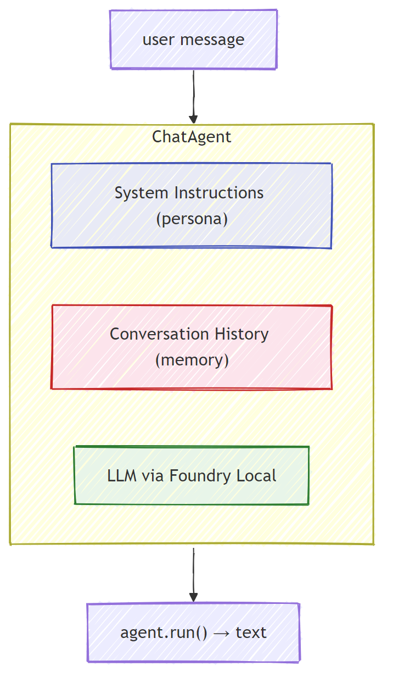

# Part 5: Building AI Agents with the Agent Framework

> **Goal:** Build your first AI agent with persistent instructions and a defined persona, powered by a local model through Foundry Local.

## What Is an AI Agent?

An AI agent wraps a language model with **system instructions** that define its behaviour, personality, and constraints. Unlike a single chat completion call, an agent provides:

- **Persona** - a consistent identity ("You are a helpful code reviewer")
- **Memory** - conversation history across turns
- **Specialisation** - focused behaviour driven by well-crafted instructions



---

## The Microsoft Agent Framework

The **Microsoft Agent Framework** (AGF) provides a standard agent abstraction that works across different model backends. In this workshop we pair it with Foundry Local so everything runs on your machine - no cloud required.

| Concept | Description |
|---------|-------------|
| `FoundryLocalClient` | Python: handles service start, model download/load, and creates agents |
| `client.as_agent()` | Python: creates an agent from the Foundry Local client |
| `AsAIAgent()` | C#: extension method on `ChatClient` - creates an `AIAgent` |
| `instructions` | System prompt that shapes the agent's behaviour |
| `name` | Human-readable label, useful in multi-agent scenarios |
| `agent.run(prompt)` / `RunAsync()` | Sends a user message and returns the agent's response |

> **Note:** The Agent Framework has a Python and .NET SDK. For JavaScript, we implement a lightweight `ChatAgent` class that mirrors the same pattern using the OpenAI SDK directly.

---

## Exercises

### Exercise 1 - Understand the Agent Pattern

Before writing code, study the key components of an agent:

1. **Model client** - connects to Foundry Local's OpenAI-compatible API
2. **System instructions** - the "personality" prompt
3. **Run loop** - send user input, receive output

> **Think about it:** How do system instructions differ from a regular user message? What happens if you change them?

---

### Exercise 2 - Run the Single-Agent Example

<details>
<summary><strong>🐍 Python</strong></summary>

**Prerequisites:**
```bash
cd python
python -m venv venv

# Windows (PowerShell):
venv\Scripts\Activate.ps1
# macOS:
source venv/bin/activate

pip install -r requirements.txt
```

**Run:**
```bash
python foundry-local-with-agf.py
```

**Code walkthrough** (`python/foundry-local-with-agf.py`):

```python
import asyncio
from agent_framework.microsoft import FoundryLocalClient

async def main():
    alias = "phi-4-mini"

    # FoundryLocalClient handles service start, model download, and loading
    client = FoundryLocalClient(model_id=alias)
    print(f"Client Model ID: {client.model_id}")

    # Create an agent with system instructions
    agent = client.as_agent(
        name="Joker",
        instructions="You are good at telling jokes.",
    )

    # Non-streaming: get the complete response at once
    result = await agent.run("Tell me a joke about a pirate.")
    print(f"Agent: {result}")

    # Streaming: get results as they are generated
    async for chunk in agent.run("Tell me another joke.", stream=True):
        if chunk.text:
            print(chunk.text, end="", flush=True)

asyncio.run(main())
```

**Key points:**
- `FoundryLocalClient(model_id=alias)` handles service start, download, and model loading in one step
- `client.as_agent()` creates an agent with system instructions and a name
- `agent.run()` supports both non-streaming and streaming modes
- Install via `pip install agent-framework-foundry-local --pre`

</details>

<details>
<summary><strong>📦 JavaScript</strong></summary>

**Prerequisites:**
```bash
cd javascript
npm install
```

**Run:**
```bash
node foundry-local-with-agent.mjs
```

**Code walkthrough** (`javascript/foundry-local-with-agent.mjs`):

```javascript
import { OpenAI } from "openai";
import { FoundryLocalManager } from "foundry-local-sdk";

class ChatAgent {
  constructor({ client, modelId, instructions, name }) {
    this.client = client;
    this.modelId = modelId;
    this.instructions = instructions;
    this.name = name;
    this.history = [];
  }

  async run(userMessage) {
    const messages = [
      { role: "system", content: this.instructions },
      ...this.history,
      { role: "user", content: userMessage },
    ];
    const response = await this.client.chat.completions.create({
      model: this.modelId,
      messages,
    });
    const assistantMessage = response.choices[0].message.content;

    // Keep conversation history for multi-turn interactions
    this.history.push({ role: "user", content: userMessage });
    this.history.push({ role: "assistant", content: assistantMessage });
    return { text: assistantMessage };
  }
}

async function main() {
  const manager = new FoundryLocalManager();
  await manager.startService();

  const cachedModels = await manager.listCachedModels();
  const catalogInfo = await manager.getModelInfo("phi-3.5-mini");
  const isAlreadyCached = cachedModels.some((m) => m.id === catalogInfo?.id);
  if (!isAlreadyCached) {
    console.log("Downloading model: phi-3.5-mini...");
    await manager.downloadModel("phi-3.5-mini");
  }
  const modelInfo = await manager.loadModel("phi-3.5-mini");

  const client = new OpenAI({
    baseURL: manager.endpoint,
    apiKey: manager.apiKey,
  });

  const agent = new ChatAgent({
    client,
    modelId: modelInfo.id,
    instructions: "You are good at telling jokes.",
    name: "Joker",
  });

  const result = await agent.run("Tell me a joke about a pirate.");
  console.log(result.text);
}

main();
```

**Key points:**
- JavaScript builds its own `ChatAgent` class mirroring the Python AGF pattern
- `this.history` stores conversation turns for multi-turn support
- Explicit `startService()` → cache check → `downloadModel()` → `loadModel()` gives full visibility

</details>

<details>
<summary><strong>💜 C#</strong></summary>

**Prerequisites:**
```bash
cd csharp
dotnet restore
```

**Run:**
```bash
dotnet run agent
```

**Code walkthrough** (`csharp/SingleAgent.cs`):

```csharp
using Microsoft.AI.Foundry.Local;
using Microsoft.Agents.AI;
using OpenAI;
using System.ClientModel;

// 1. Start Foundry Local and load a model
var alias = "phi-4-mini";
var manager = await FoundryLocalManager.StartServiceAsync();

var cachedModels = await manager.ListCachedModelsAsync();
var catalogInfo = await manager.GetModelInfoAsync(aliasOrModelId: alias);
var isCached = cachedModels.Any(m => m.ModelId == catalogInfo?.ModelId);
if (!isCached)
{
    Console.WriteLine($"Downloading model: {alias}...");
    await manager.DownloadModelAsync(aliasOrModelId: alias);
}
var model = await manager.LoadModelAsync(aliasOrModelId: alias);

var key = new ApiKeyCredential(manager.ApiKey);
var client = new OpenAIClient(key, new OpenAIClientOptions
{
    Endpoint = manager.Endpoint
});

// 2. Create an AIAgent using the Agent Framework extension method
AIAgent joker = client
    .GetChatClient(model?.ModelId)
    .AsAIAgent(
        instructions: "You are good at telling jokes. Keep your jokes short and family-friendly.",
        name: "Joker"
    );

// 3. Run the agent (non-streaming)
var response = await joker.RunAsync("Tell me a joke about a pirate.");
Console.WriteLine($"Joker: {response}");

// 4. Run with streaming
await foreach (var update in joker.RunStreamingAsync("Tell me another joke."))
{
    Console.Write(update);
}
```

**Key points:**
- `AsAIAgent()` is an extension method from `Microsoft.Agents.AI.OpenAI` - no custom `ChatAgent` class needed
- `RunAsync()` returns the full response; `RunStreamingAsync()` streams token by token
- Install via `dotnet add package Microsoft.Agents.AI.OpenAI --version 1.0.0-rc3`

</details>

---

### Exercise 3 - Change the Persona

Modify the agent's `instructions` to create a different persona. Try each one and observe how the output changes:

| Persona | Instructions |
|---------|-------------|
| Code Reviewer | `"You are an expert code reviewer. Provide constructive feedback focused on readability, performance, and correctness."` |
| Travel Guide | `"You are a friendly travel guide. Give personalized recommendations for destinations, activities, and local cuisine."` |
| Socratic Tutor | `"You are a Socratic tutor. Never give direct answers - instead, guide the student with thoughtful questions."` |
| Technical Writer | `"You are a technical writer. Explain concepts clearly and concisely. Use examples. Avoid jargon."` |

**Try it:**
1. Pick a persona from the table above
2. Replace the `instructions` string in the code
3. Adjust the user prompt to match (e.g., ask the code reviewer to review a function)
4. Run the example again and compare the output

> **Tip:** The quality of an agent depends heavily on the instructions. Specific, well-structured instructions produce better results than vague ones.

---

### Exercise 4 - Add Multi-Turn Conversation

Extend the example to support a multi-turn chat loop so you can have a back-and-forth conversation with the agent.

<details>
<summary><strong>🐍 Python - multi-turn loop</strong></summary>

```python
import asyncio
from agent_framework.microsoft import FoundryLocalClient

async def main():
    client = FoundryLocalClient(model_id="phi-4-mini")

    agent = client.as_agent(
        name="Assistant",
        instructions="You are a helpful assistant.",
    )

    print("Chat with the agent (type 'quit' to exit):\n")
    while True:
        user_input = input("You: ")
        if user_input.strip().lower() in ("quit", "exit"):
            break
        result = await agent.run(user_input)
        print(f"Agent: {result}\n")

asyncio.run(main())
```

</details>

<details>
<summary><strong>📦 JavaScript - multi-turn loop</strong></summary>

```javascript
import { OpenAI } from "openai";
import { FoundryLocalManager } from "foundry-local-sdk";
import * as readline from "node:readline/promises";

// (reuse ChatAgent class from Exercise 2)

async function main() {
  const manager = new FoundryLocalManager();
  await manager.startService();

  const cachedModels = await manager.listCachedModels();
  const catalogInfo = await manager.getModelInfo("phi-3.5-mini");
  const isAlreadyCached = cachedModels.some((m) => m.id === catalogInfo?.id);
  if (!isAlreadyCached) {
    console.log("Downloading model: phi-3.5-mini...");
    await manager.downloadModel("phi-3.5-mini");
  }
  const modelInfo = await manager.loadModel("phi-3.5-mini");

  const client = new OpenAI({
    baseURL: manager.endpoint,
    apiKey: manager.apiKey,
  });

  const agent = new ChatAgent({
    client,
    modelId: modelInfo.id,
    instructions: "You are a helpful assistant.",
    name: "Assistant",
  });

  const rl = readline.createInterface({
    input: process.stdin,
    output: process.stdout,
  });

  console.log("Chat with the agent (type 'quit' to exit):\n");
  while (true) {
    const userInput = await rl.question("You: ");
    if (["quit", "exit"].includes(userInput.trim().toLowerCase())) break;
    const result = await agent.run(userInput);
    console.log(`Agent: ${result.text}\n`);
  }
  rl.close();
}

main();
```

</details>

<details>
<summary><strong>💜 C# - multi-turn loop</strong></summary>

```csharp
using Microsoft.AI.Foundry.Local;
using Microsoft.Agents.AI;
using OpenAI;
using System.ClientModel;

var alias = "phi-4-mini";
var manager = await FoundryLocalManager.StartServiceAsync();

var cachedModels = await manager.ListCachedModelsAsync();
var catalogInfo = await manager.GetModelInfoAsync(aliasOrModelId: alias);
var isCached = cachedModels.Any(m => m.ModelId == catalogInfo?.ModelId);
if (!isCached)
{
    Console.WriteLine($"Downloading model: {alias}...");
    await manager.DownloadModelAsync(aliasOrModelId: alias);
}
var model = await manager.LoadModelAsync(aliasOrModelId: alias);

var key = new ApiKeyCredential(manager.ApiKey);
var client = new OpenAIClient(key, new OpenAIClientOptions
{
    Endpoint = manager.Endpoint
});

AIAgent agent = client
    .GetChatClient(model?.ModelId)
    .AsAIAgent(
        instructions: "You are a helpful assistant.",
        name: "Assistant"
    );

Console.WriteLine("Chat with the agent (type 'quit' to exit):\n");
while (true)
{
    Console.Write("You: ");
    var userInput = Console.ReadLine();
    if (string.IsNullOrWhiteSpace(userInput) ||
        userInput.Equals("quit", StringComparison.OrdinalIgnoreCase) ||
        userInput.Equals("exit", StringComparison.OrdinalIgnoreCase))
        break;

    var result = await agent.RunAsync(userInput);
    Console.WriteLine($"Agent: {result}\n");
}
```

</details>

Notice how the agent remembers previous turns - ask a follow-up question and see the context carry through.

---

### Exercise 5 - Structured Output

Instruct the agent to always respond in a specific format (e.g., JSON) and parse the result:

<details>
<summary><strong>🐍 Python - JSON output</strong></summary>

```python
import asyncio
import json
from agent_framework.microsoft import FoundryLocalClient

async def main():
    client = FoundryLocalClient(model_id="phi-4-mini")

    agent = client.as_agent(
        name="SentimentAnalyzer",
        instructions=(
            "You are a sentiment analysis agent. "
            "For every user message, respond ONLY with valid JSON in this format: "
            '{"sentiment": "positive|negative|neutral", "confidence": 0.0-1.0, "summary": "brief reason"}'
        ),
    )

    result = await agent.run("I absolutely loved the new restaurant downtown!")
    print("Raw:", result)

    try:
        parsed = json.loads(str(result))
        print(f"Sentiment: {parsed['sentiment']} (confidence: {parsed['confidence']})")
    except json.JSONDecodeError:
        print("Agent did not return valid JSON - try refining the instructions.")

asyncio.run(main())
```

</details>

<details>
<summary><strong>💜 C# - JSON output</strong></summary>

```csharp
using System.Text.Json;

AIAgent analyzer = chatClient.AsAIAgent(
    name: "SentimentAnalyzer",
    instructions:
        "You are a sentiment analysis agent. " +
        "For every user message, respond ONLY with valid JSON in this format: " +
        "{\"sentiment\": \"positive|negative|neutral\", \"confidence\": 0.0-1.0, \"summary\": \"brief reason\"}"
);

var response = await analyzer.RunAsync("I absolutely loved the new restaurant downtown!");
Console.WriteLine($"Raw: {response}");

try
{
    var parsed = JsonSerializer.Deserialize<JsonElement>(response.ToString());
    Console.WriteLine($"Sentiment: {parsed.GetProperty("sentiment")} " +
                      $"(confidence: {parsed.GetProperty("confidence")})");
}
catch (JsonException)
{
    Console.WriteLine("Agent did not return valid JSON - try refining the instructions.");
}
```

</details>

> **Note:** Small local models may not always produce perfectly valid JSON. You can improve reliability by including an example in the instructions and being very explicit about the expected format.

---

## Key Takeaways

| Concept | What You Learned |
|---------|-----------------|
| Agent vs. raw LLM call | An agent wraps a model with instructions and memory |
| System instructions | The most important lever for controlling agent behaviour |
| Multi-turn conversation | Agents can carry context across multiple user interactions |
| Structured output | Instructions can enforce output format (JSON, markdown, etc.) |
| Local execution | Everything runs on-device via Foundry Local - no cloud required |

---

## Next Steps

In **[Part 6: Multi-Agent Workflows](part6-multi-agent-workflows.md)**, you'll combine multiple agents into a coordinated pipeline where each agent has a specialised role.
