# Part 8: Evaluation-Led Development with Foundry Local

> **Goal:** Build an evaluation framework that systematically tests and scores your AI agents, using the same local model as both the agent under test and the judge, so you can iterate on prompts with confidence before shipping.

## Why Evaluation-Led Development?

When building AI agents, "it looks about right" is not good enough. **Evaluation-led development** treats agent outputs like code: you write tests first, measure quality, and only ship when scores meet a threshold.

In the Zava Creative Writer (Part 7), the **Editor agent** already acts as a lightweight evaluator; it decides ACCEPT or REVISE. This lab formalises that pattern into a repeatable evaluation framework you can apply to any agent or pipeline.

| Problem | Solution |
|---------|----------|
| Prompt changes silently break quality | **Golden dataset** catches regressions |
| "Works on one example" bias | **Multiple test cases** reveal edge cases |
| Subjective quality assessment | **Rule-based + LLM-as-judge scoring** provides numbers |
| No way to compare prompt variants | **Side-by-side eval runs** with aggregate scores |

---

## Key Concepts

### 1. Golden Datasets

A **golden dataset** is a curated set of test cases with known expected outputs. Each test case includes:

- **Input**: The prompt or question to send to the agent
- **Expected output**: What a correct or high-quality response should contain (keywords, structure, facts)
- **Category**: Grouping for reporting (e.g. "factual accuracy", "tone", "completeness")

### 2. Rule-Based Checks

Fast, deterministic checks that do not require an LLM:

| Check | What It Tests |
|-------|--------------|
| **Length bounds** | Response is not too short (lazy) or too long (rambling) |
| **Required keywords** | Response mentions expected terms or entities |
| **Format validation** | JSON is parsable, Markdown headers are present |
| **Forbidden content** | No hallucinated brand names, no competitor mentions |

### 3. LLM-as-Judge

Use the **same local model** to grade its own outputs (or outputs from a different prompt variant). The judge receives:

- The original question
- The agent's response
- Grading criteria

And returns a structured score. This mirrors the Editor pattern from Part 7 but applied systematically across a test suite.

### 4. Eval-Driven Iteration Loop



---

## Prerequisites

| Requirement | Details |
|-------------|---------|
| **Foundry Local CLI** | Installed with a model downloaded |
| **Language runtime** | **Python 3.9+** and/or **Node.js 18+** and/or **.NET 8+ SDK** |
| **Completed** | [Part 5: Single Agents](part5-single-agents.md) and [Part 6: Multi-Agent Workflows](part6-multi-agent-workflows.md) |

---

## Lab Exercises

### Exercise 1 - Run the Evaluation Framework

The workshop includes a complete evaluation sample that tests a Foundry Local agent against a golden dataset of Zava DIY-related questions.

<details>
<summary><strong>🐍 Python</strong></summary>

**Setup:**
```bash
cd python
python -m venv venv

# Windows (PowerShell):
venv\Scripts\Activate.ps1
# macOS:
source venv/bin/activate

pip install -r requirements.txt
```

**Run:**
```bash
python foundry-local-eval.py
```

**What happens:**
1. Connects to Foundry Local and loads the model
2. Defines a golden dataset of 5 test cases (Zava product questions)
3. Runs two prompt variants against every test case
4. Scores each response with **rule-based checks** (length, keywords, format)
5. Scores each response with **LLM-as-judge** (the same model grades quality 1-5)
6. Prints a scorecard comparing both prompt variants

</details>

<details>
<summary><strong>📦 JavaScript</strong></summary>

**Setup:**
```bash
cd javascript
npm install
```

**Run:**
```bash
node foundry-local-eval.mjs
```

**Same evaluation pipeline:** golden dataset, dual prompt runs, rule-based + LLM scoring, scorecard.

</details>

<details>
<summary><strong>💜 C#</strong></summary>

**Setup:**
```bash
cd csharp
dotnet restore
```

**Run:**
```bash
dotnet run eval
```

**Same evaluation pipeline:** golden dataset, dual prompt runs, rule-based + LLM scoring, scorecard.

</details>

---

### Exercise 2 - Understand the Golden Dataset

Examine the test cases defined in the evaluation sample. Each test case has:

```
{
  "input":    "What tools do I need to build a deck?",
  "expected": ["saw", "drill", "screws", "level"],
  "category": "product-recommendation"
}
```

**Questions to consider:**
1. Why are the expected values **keywords** rather than full sentences?
2. How many test cases do you need for a reliable evaluation?
3. What categories would you add for your own application?

---

### Exercise 3 - Understand Rule-Based vs LLM-as-Judge Scoring

The evaluation framework uses **two scoring layers**:

#### Rule-Based Checks (fast, deterministic)

```
✓ Length: 50-500 words       → 1 point
✓ Keywords: 3/4 found        → 0.75 points  
✗ Forbidden: mentions "Home Depot" → 0 points
─────────────────────────────
Rule score: 0.58 / 1.0
```

#### LLM-as-Judge (nuanced, qualitative)

The same local model acts as a judge with a structured rubric:

```
Rate this response on a scale of 1-5:
- 1: Completely wrong or irrelevant
- 2: Partially correct but missing key information
- 3: Adequate but could be improved
- 4: Good response with minor issues
- 5: Excellent, comprehensive, well-structured

Score: 4
Reasoning: The response correctly identifies all necessary tools
and provides practical advice, but could include safety equipment.
```

**Questions to consider:**
1. When would you trust rule-based checks over LLM-as-judge?
2. Can a model reliably judge its own output? What are the limitations?
3. How does this compare to the Editor agent pattern from Part 7?

---

### Exercise 4 - Compare Prompt Variants

The sample runs **two prompt variants** against the same test cases:

| Variant | System Prompt Style |
|---------|-------------------|
| **Baseline** | Generic: "You are a helpful assistant" |
| **Specialised** | Detailed: "You are a Zava DIY expert who recommends specific products and provides step-by-step guidance" |

After running, you will see a scorecard like:

```
╔══════════════════════════════════════════════════════════════╗
║                    EVALUATION SCORECARD                      ║
╠══════════════════════════════════════════════════════════════╣
║ Prompt Variant    │ Rule Score │ LLM Score │ Combined       ║
╠═══════════════════╪════════════╪═══════════╪════════════════╣
║ Baseline          │ 0.62       │ 3.2 / 5   │ 0.62           ║
║ Specialised       │ 0.81       │ 4.1 / 5   │ 0.81           ║
╚══════════════════════════════════════════════════════════════╝
```

**Exercises:**
1. Run the evaluation and note the scores for each variant
2. Modify the specialised prompt to be even more specific. Does the score improve?
3. Add a third prompt variant and compare all three.
4. Try changing the model alias (e.g. `phi-4-mini` vs `phi-3.5-mini`) and compare results.

---

### Exercise 5 - Apply Evaluation to Your Own Agent

Use the evaluation framework as a template for your own agents:

1. **Define your golden dataset**: write 5 to 10 test cases with expected keywords.
2. **Write your system prompt**: the agent instructions you want to test.
3. **Run the eval**: get baseline scores.
4. **Iterate**: tweak the prompt, re-run, and compare.
5. **Set a threshold**: e.g. "do not ship below 0.75 combined score".

---

### Exercise 6 - Connection to the Zava Editor Pattern

Look back at the Zava Creative Writer's Editor agent (`zava-creative-writer-local/src/api/agents/editor/editor.py`):

```python
# The editor is an LLM-as-judge in production:
{"decision": "accept/revise", "editorFeedback": "...", "researchFeedback": "..."}
```

This is the **same concept** as Part 8's LLM-as-judge, but embedded in the production pipeline rather than in an offline test suite. Both patterns:

- Use structured JSON output from the model.
- Apply quality criteria defined in the system prompt.
- Make a pass/fail decision.

**The difference:** The editor runs in production (on every request). The evaluation framework runs in development (before you ship).

---

## Key Takeaways

| Concept | Takeaway |
|---------|----------|
| **Golden datasets** | Curate test cases early; they are your regression tests for AI |
| **Rule-based checks** | Fast, deterministic, and catch obvious failures (length, keywords, format) |
| **LLM-as-judge** | Nuanced quality scoring using the same local model |
| **Prompt comparison** | Run multiple variants against the same test suite to pick the best |
| **On-device advantage** | All evaluation runs locally: no API costs, no rate limits, no data leaving your machine |
| **Eval-before-ship** | Set quality thresholds and gate releases on evaluation scores |

---

## Next Steps

- **Scale up**: Add more test cases and categories to your golden dataset.
- **Automate**: Integrate evaluation into your CI/CD pipeline.
- **Advanced judges**: Use a larger model as the judge whilst testing a smaller model's output.
- **Track over time**: Save evaluation results to compare across prompt and model versions.

---

## Next Lab

Continue to [Part 9: Voice Transcription with Whisper](part9-whisper-voice-transcription.md) to explore speech-to-text on-device using the Foundry Local SDK.
