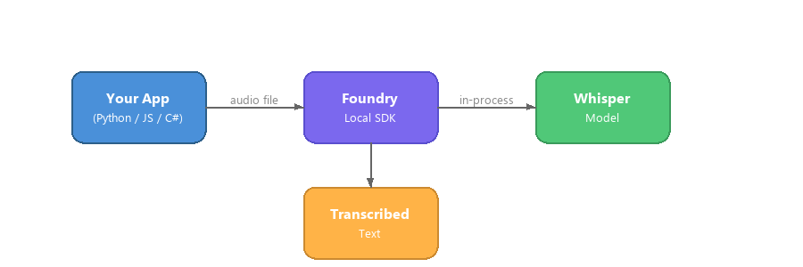

# Part 8: Voice Transcription with Whisper and Foundry Local

> **Goal:** Use the OpenAI Whisper model running locally through Foundry Local to transcribe audio files — completely on-device, no cloud required.

## Overview

Foundry Local isn't just for text generation — it also supports **speech-to-text** models. In this lab you'll use the **OpenAI Whisper Medium** model to transcribe audio files entirely on your machine. This is ideal for scenarios like transcribing Zava customer service calls, product review recordings, or workshop planning sessions where audio data must never leave your device.


---

## Learning Objectives

By the end of this lab you will be able to:

- Understand the Whisper speech-to-text model and its capabilities
- Download and run the Whisper model using Foundry Local
- Transcribe audio files using the Foundry Local SDK in Python, JavaScript, and C#
- Build a simple transcription service that runs entirely on-device
- Understand the differences between chat/text models and audio models in Foundry Local

---

## Prerequisites

| Requirement | Details |
|-------------|---------|
| **Foundry Local CLI** | Version **0.8.101 or earlier** (Whisper models are not available in versions above 0.8.101) |
| **OS** | Windows 10/11 (x64 or ARM64) |
| **Language runtime** | **Python 3.9+** and/or **Node.js 18+** and/or **.NET 10 SDK** ([Download .NET](https://dotnet.microsoft.com/download/dotnet/10.0)) |
| **Completed** | [Part 1: Getting Started](part1-getting-started.md), [Part 2: Foundry Local SDK Deep Dive](part2-foundry-local-sdk.md), and [Part 3: SDKs and APIs](part3-sdk-and-apis.md) |

> **Important Version Requirement:** Whisper models are **only available in Foundry Local v0.8.101 and earlier**. If you have a newer version installed, you will need to downgrade. Check your version with:
> ```bash
> foundry --version
> ```

---

## Concept: How Whisper Works with Foundry Local

The OpenAI Whisper model is a general-purpose speech recognition model trained on a large dataset of diverse audio. When running through Foundry Local:

- The model runs **entirely on your CPU** — no GPU required
- Audio never leaves your device — **complete privacy**
- The SDK provides an `AudioClient` (separate from the `ChatClient` used for text models)
- The API is **OpenAI-compatible** — same `POST /v1/audio/transcriptions` endpoint format



### Whisper Model Variants

| Alias | Model ID | Device | Size | Description |
|-------|----------|--------|------|-------------|
| `whisper-medium` | `openai-whisper-medium-cuda-gpu:1` | GPU | 1.53 GB | GPU-accelerated (CUDA) |
| `whisper-medium` | `openai-whisper-medium-generic-cpu:1` | CPU | 3.05 GB | CPU-optimized (recommended for most devices) |

> **Note:** Unlike chat models that list by default, Whisper models are categorized under the `automatic-speech-recognition` task. Use `foundry model info whisper-medium` to see details.

---

## Lab Exercises

### Exercise 0 — Get Sample Audio Files

This lab includes pre-built WAV files based on Zava DIY product scenarios. Generate them with the included script:

```bash
# From the repo root — create and activate a .venv first
python -m venv .venv

# Windows (PowerShell):
.venv\Scripts\Activate.ps1
# macOS:
source .venv/bin/activate

pip install openai
python samples/audio/generate_samples.py
```

This creates five WAV files in `samples/audio/`:

| File | Scenario |
|------|----------|
| `zava-customer-inquiry.wav` | Customer asking about the **Zava ProGrip Cordless Drill** |
| `zava-product-review.wav` | Customer reviewing the **Zava UltraSmooth Interior Paint** |
| `zava-support-call.wav` | Support call about the **Zava TitanLock Tool Chest** |
| `zava-project-planning.wav` | DIYer planning a deck with **Zava EcoBoard Composite Decking** |
| `zava-workshop-setup.wav` | Walkthrough of a workshop using **all five Zava products** |

> **Tip:** You can also use your own WAV/MP3/M4A files, or record yourself with Windows Voice Recorder.

---

### Exercise 1 — Download the Whisper Model Using the SDK

Due to CLI incompatibilities with Whisper models in newer Foundry Local versions, use the **SDK** to download and load the model. Choose your language:

<details>
<summary><b>🐍 Python</b></summary>

**Install the SDK:**
```bash
pip install foundry-local-sdk
```

```python
from foundry_local import FoundryLocalManager

alias = "whisper-medium"

# Start the service
manager = FoundryLocalManager()
manager.start_service()

# Check catalog info
info = manager.get_model_info(alias)
print(f"Model: {info.id}")
print(f"Task:  {info.task}")

# Check if already cached
cached = manager.list_cached_models()
is_cached = any(m.id == info.id for m in cached) if info else False

if is_cached:
    print("Whisper model already downloaded.")
else:
    print("Downloading Whisper model (this may take several minutes)...")
    manager.download_model(alias)
    print("Download complete.")

# Load the model into memory
manager.load_model(alias)
print(f"Whisper model loaded. Endpoint: {manager.endpoint}")
```

Save as `download_whisper.py` and run:
```bash
python download_whisper.py
```

</details>

<details>
<summary><b>📘 JavaScript</b></summary>

**Install the SDK:**
```bash
npm install foundry-local-sdk
```

```javascript
import { FoundryLocalManager } from "foundry-local-sdk";

const alias = "whisper-medium";
const manager = new FoundryLocalManager();

// Start the service
await manager.startService();

// Check catalog info
const info = await manager.getModelInfo(alias);
console.log(`Model: ${info.id}`);

// Check if already cached
const cached = await manager.listCachedModels();
const isCached = cached.some((m) => m.id === info?.id);

if (isCached) {
  console.log("Whisper model already downloaded.");
} else {
  console.log("Downloading Whisper model (this may take several minutes)...");
  await manager.downloadModel(alias);
  console.log("Download complete.");
}

// Load the model into memory
const modelInfo = await manager.loadModel(alias);
console.log(`Whisper model loaded. Endpoint: ${manager.endpoint}`);
```

Save as `download-whisper.mjs` and run:
```bash
node download-whisper.mjs
```

</details>

<details>
<summary><b>💜 C#</b></summary>

**Install the SDK:**
```bash
dotnet add package Microsoft.AI.Foundry.Local
```

```csharp
using Microsoft.AI.Foundry.Local;

var alias = "whisper-medium";

// Start the service
Console.WriteLine("Starting Foundry Local service...");
var manager = await FoundryLocalManager.StartServiceAsync();

// Check catalog info
var info = await manager.GetModelInfoAsync(aliasOrModelId: alias);
Console.WriteLine($"Model: {info?.ModelId}");

// Check if already cached
var cached = await manager.ListCachedModelsAsync();
var isCached = cached.Any(m => m.ModelId == info?.ModelId);

if (isCached)
{
    Console.WriteLine("Whisper model already downloaded.");
}
else
{
    Console.WriteLine("Downloading Whisper model (this may take several minutes)...");
    await manager.DownloadModelAsync(aliasOrModelId: alias);
    Console.WriteLine("Download complete.");
}

// Load the model into memory
var model = await manager.LoadModelAsync(aliasOrModelId: alias);
Console.WriteLine($"Whisper model loaded. Endpoint: {manager.Endpoint}");
```

</details>

> **Why SDK instead of CLI?** The Foundry Local CLI has known incompatibilities with Whisper model download commands in certain versions. The SDK provides a reliable, version-independent way to download and load models programmatically.

---

### Exercise 2 — Understand the Whisper SDK

Whisper transcription uses the **OpenAI-compatible audio transcription API** (`POST /v1/audio/transcriptions`). In Python and JavaScript, you use the same OpenAI SDK you already know — just call `client.audio.transcriptions.create()` instead of `client.chat.completions.create()`. In C#, Foundry Local provides a native `AudioClient` via the WinML package for in-process transcription.

| Component | Python | JavaScript | C# |
|-----------|--------|------------|----|
| **SDK packages** | `foundry-local-sdk`, `openai` | `foundry-local-sdk`, `openai` | `Microsoft.AI.Foundry.Local.WinML` |
| **Client type** | `openai.OpenAI` (audio endpoint) | `OpenAI` (audio endpoint) | `AudioClient` (via Foundry SDK) |
| **SDK method** | `client.audio.transcriptions.create()` | `client.audio.transcriptions.create()` | `audioClient.TranscribeAudioAsync()` |
| **Input** | File object (`open(path, "rb")`) | `fs.createReadStream(path)` | Audio file path (string) |
| **Output** | `result.text` | `result.text` | `result.Text` |
| **Model init** | `FoundryLocalManager(alias)` bootstrap | `manager.init(alias)` one-liner | `FoundryLocalManager.CreateAsync()` + `catalog.GetModelAsync()` |

> **SDK Patterns:** Python uses the constructor bootstrap `FoundryLocalManager(alias)`, JavaScript uses `manager.init(alias)`, and C# uses the object-oriented `CreateAsync()` + catalog pattern. See [Part 2: Foundry Local SDK Deep Dive](part2-foundry-local-sdk.md) for full details.

---

### Exercise 3 — Build a Simple Transcription App

Choose your language track and build a minimal application that transcribes an audio file.

> **Supported audio formats:** WAV, MP3, M4A. For best results, use WAV files with 16kHz sample rate.

<details>
<summary><h3>🐍 Python Track</h3></summary>

#### Setup

```bash
cd python
python -m venv venv

# Activate the virtual environment:
# Windows (PowerShell):
venv\Scripts\Activate.ps1
# macOS:
source venv/bin/activate

pip install foundry-local-sdk openai
```

#### Transcription Code

Create a file `foundry-local-whisper.py`:

```python
import sys
import os
import openai
from foundry_local import FoundryLocalManager

model_alias = "whisper-medium"
audio_file = sys.argv[1] if len(sys.argv) > 1 else "sample.wav"

if not os.path.exists(audio_file):
    print(f"Audio file not found: {audio_file}")
    print("Usage: python foundry-local-whisper.py <path-to-audio-file>")
    sys.exit(1)

# Step 1: Bootstrap — starts service, downloads, and loads the model
print(f"Initializing Foundry Local with model: {model_alias}...")
manager = FoundryLocalManager(model_alias)

# Step 2: Transcribe audio using the OpenAI-compatible API
client = openai.OpenAI(
    base_url=manager.endpoint,
    api_key=manager.api_key
)

print(f"Transcribing: {audio_file}")
with open(audio_file, "rb") as f:
    result = client.audio.transcriptions.create(
        model=manager.get_model_info(model_alias).id,
        file=f
    )

print("\n--- Transcription ---")
print(result.text)
print("---------------------")
```

#### Run it

```bash
# Transcribe a Zava product scenario
python foundry-local-whisper.py ../samples/audio/zava-customer-inquiry.wav

# Or try others:
python foundry-local-whisper.py ../samples/audio/zava-product-review.wav
python foundry-local-whisper.py ../samples/audio/zava-workshop-setup.wav
```

#### Key Python Points

| Method | Purpose |
|--------|---------|
| `FoundryLocalManager(alias)` | Bootstrap: start service, download, and load in one call |
| `manager.endpoint` | Get the dynamic API endpoint |
| `client.audio.transcriptions.create()` | Transcribe audio via OpenAI-compatible API |
| `result.text` | The transcribed text |

</details>

<details>
<summary><h3>📘 JavaScript Track</h3></summary>

#### Setup

```bash
cd javascript
npm install openai foundry-local-sdk
```

#### Transcription Code

Create a file `foundry-local-whisper.mjs`:

```javascript
import { OpenAI } from "openai";
import { FoundryLocalManager } from "foundry-local-sdk";
import fs from "node:fs";

const modelAlias = "whisper-medium";
const audioFile = process.argv[2] || "sample.wav";

if (!fs.existsSync(audioFile)) {
  console.error(`Audio file not found: ${audioFile}`);
  console.error("Usage: node foundry-local-whisper.mjs <path-to-audio-file>");
  process.exit(1);
}

// Step 1: Initialize — starts service, downloads, and loads the model
console.log(`Initializing Foundry Local with model: ${modelAlias}...`);
const manager = new FoundryLocalManager();
const modelInfo = await manager.init(modelAlias);

// Step 2: Transcribe audio using the OpenAI-compatible API
const client = new OpenAI({
  baseURL: manager.endpoint,
  apiKey: manager.apiKey,
});

console.log(`Transcribing: ${audioFile}`);
const result = await client.audio.transcriptions.create({
  model: modelInfo.id,
  file: fs.createReadStream(audioFile),
});

console.log("\n--- Transcription ---");
console.log(result.text);
console.log("---------------------");
```

#### Run it

```bash
# Transcribe a Zava product scenario
node foundry-local-whisper.mjs ../samples/audio/zava-customer-inquiry.wav

# Or try others:
node foundry-local-whisper.mjs ../samples/audio/zava-support-call.wav
node foundry-local-whisper.mjs ../samples/audio/zava-project-planning.wav
```

#### Key JavaScript Points

| Method | Purpose |
|--------|---------|
| `await manager.init(alias)` | Initialize: start service, download, and load in one call |
| `manager.endpoint` | Get the dynamic API endpoint |
| `client.audio.transcriptions.create()` | Transcribe audio via OpenAI-compatible API |
| `result.text` | The transcribed text |

</details>

<details>
<summary><h3>💜 C# Track</h3></summary>

#### Setup

```bash
mkdir whisper-demo
cd whisper-demo
dotnet new console --framework net10.0-windows10.0.26100
dotnet add package Microsoft.AI.Foundry.Local.WinML --version 0.8.2.1
```

> **Note:** The C# track uses the `Microsoft.AI.Foundry.Local.WinML` package, which provides an in-process `AudioClient` instead of going through the OpenAI SDK. This is more efficient but Windows-only.

#### Transcription Code

Replace the contents of `Program.cs`:

```csharp
using Microsoft.AI.Foundry.Local;

// --- Configuration ---
var modelAlias = "whisper-medium";
var audioFile = args.Length > 0 ? args[0] : "sample.wav";

if (!File.Exists(audioFile))
{
    Console.WriteLine($"Audio file not found: {audioFile}");
    Console.WriteLine("Usage: dotnet run <path-to-audio-file>");
    return;
}

// --- Step 1: Initialize Foundry Local ---
Console.WriteLine("Initializing Foundry Local...");

var config = new Configuration
{
    AppName = "WhisperDemo",
    LogLevel = LogLevel.Information
};

await FoundryLocalManager.CreateAsync(config);
var manager = FoundryLocalManager.Instance;

// Ensure execution providers are available
await manager.EnsureEpsDownloadedAsync();

// --- Step 2: Load the Whisper model ---
Console.WriteLine($"Loading model: {modelAlias}...");

var catalog = await manager.GetCatalogAsync()
    ?? throw new Exception("Failed to get model catalog.");

var model = await catalog.GetModelAsync(modelAlias)
    ?? throw new Exception($"Model '{modelAlias}' not found in catalog.");

// Prefer CPU variant for broadest compatibility
var cpuVariant = model.Variants
    .FirstOrDefault(v => v.Info.Runtime?.DeviceType == DeviceType.CPU);

if (cpuVariant != null)
{
    model.SelectVariant(cpuVariant);
}

// Download if needed (shows progress)
Console.WriteLine("Downloading model if needed...");
await model.DownloadAsync(progress =>
{
    if (progress % 10 == 0)
        Console.Write(".");
});
Console.WriteLine();

// Load model into memory
Console.WriteLine("Loading model into memory...");
await model.LoadAsync();

// --- Step 3: Transcribe audio ---
Console.WriteLine($"Transcribing: {audioFile}");

var audioClient = await model.GetAudioClientAsync()
    ?? throw new Exception("Failed to get audio client.");

var result = await audioClient.TranscribeAudioAsync(audioFile);

Console.WriteLine("\n--- Transcription ---");
Console.WriteLine(result.Text);
Console.WriteLine("---------------------");
```

#### Run it

```bash
# Transcribe a Zava product scenario
dotnet run -- ..\samples\audio\zava-customer-inquiry.wav

# Or try others:
dotnet run -- ..\samples\audio\zava-product-review.wav
dotnet run -- ..\samples\audio\zava-workshop-setup.wav
```

#### Key C# Points

| Method | Purpose |
|--------|---------|
| `FoundryLocalManager.CreateAsync(config)` | Initialize Foundry Local with configuration |
| `manager.EnsureEpsDownloadedAsync()` | Download execution providers |
| `catalog.GetModelAsync(alias)` | Get model from catalog |
| `model.DownloadAsync()` | Download the Whisper model |
| `model.GetAudioClientAsync()` | Get the AudioClient (not ChatClient!) |
| `audioClient.TranscribeAudioAsync(path)` | Transcribe an audio file |
| `result.Text` | The transcribed text |

> **C# vs Python/JS:** The C# track uses the `WinML` package for in-process transcription, while Python and JavaScript use the Foundry Local service with the OpenAI-compatible audio transcription endpoint.

</details>

---

### Exercise 4 — Batch Transcribe All Zava Samples

Now that you have a working transcription app, transcribe all five Zava sample files and compare the results.

<details>
<summary><h3>🐍 Python Track</h3></summary>

Create `foundry-local-whisper-batch.py`:

```python
import os
import glob
import openai
from foundry_local import FoundryLocalManager

model_alias = "whisper-medium"
samples_dir = os.path.join("..", "samples", "audio")

# Bootstrap — starts service, downloads, and loads the model
manager = FoundryLocalManager(model_alias)

client = openai.OpenAI(
    base_url=manager.endpoint,
    api_key=manager.api_key
)
model_id = manager.get_model_info(model_alias).id

# Transcribe each WAV file
for wav_path in sorted(glob.glob(os.path.join(samples_dir, "zava-*.wav"))):
    filename = os.path.basename(wav_path)
    print(f"\n{'='*60}")
    print(f"File: {filename}")
    print(f"{'='*60}")

    with open(wav_path, "rb") as f:
        result = client.audio.transcriptions.create(
            model=model_id,
            file=f
        )
    print(result.text)

print(f"\n\nDone — transcribed {len(glob.glob(os.path.join(samples_dir, 'zava-*.wav')))} files.")
```

```bash
python foundry-local-whisper-batch.py
```

</details>

<details>
<summary><h3>📘 JavaScript Track</h3></summary>

Create `foundry-local-whisper-batch.mjs`:

```javascript
import { OpenAI } from "openai";
import { FoundryLocalManager } from "foundry-local-sdk";
import fs from "node:fs";
import path from "node:path";

const modelAlias = "whisper-medium";
const samplesDir = path.join("..", "samples", "audio");

// Initialize — starts service, downloads, and loads the model
const manager = new FoundryLocalManager();
const modelInfo = await manager.init(modelAlias);

const client = new OpenAI({
  baseURL: manager.endpoint,
  apiKey: manager.apiKey,
});

// Find all Zava WAV files
const wavFiles = fs.readdirSync(samplesDir)
  .filter((f) => f.startsWith("zava-") && f.endsWith(".wav"))
  .sort();

for (const filename of wavFiles) {
  const filePath = path.join(samplesDir, filename);
  console.log(`\n${"=".repeat(60)}`);
  console.log(`File: ${filename}`);
  console.log("=".repeat(60));

  const result = await client.audio.transcriptions.create({
    model: modelInfo.id,
    file: fs.createReadStream(filePath),
  });
  console.log(result.text);
}

console.log(`\n\nDone — transcribed ${wavFiles.length} files.`);
```

```bash
node foundry-local-whisper-batch.mjs
```

</details>

<details>
<summary><h3>💜 C# Track</h3></summary>

Update `Program.cs` to batch-transcribe:

```csharp
using Microsoft.AI.Foundry.Local;

var modelAlias = "whisper-medium";
var samplesDir = Path.Combine("..", "samples", "audio");

// Initialize Foundry Local
var config = new Configuration
{
    AppName = "WhisperBatch",
    LogLevel = LogLevel.Information
};

await FoundryLocalManager.CreateAsync(config);
var manager = FoundryLocalManager.Instance;
await manager.EnsureEpsDownloadedAsync();

var catalog = await manager.GetCatalogAsync()
    ?? throw new Exception("Failed to get model catalog.");
var model = await catalog.GetModelAsync(modelAlias)
    ?? throw new Exception($"Model '{modelAlias}' not found.");

var cpuVariant = model.Variants
    .FirstOrDefault(v => v.Info.Runtime?.DeviceType == DeviceType.CPU);
if (cpuVariant != null) model.SelectVariant(cpuVariant);

await model.DownloadAsync(_ => { });
await model.LoadAsync();

var audioClient = await model.GetAudioClientAsync()
    ?? throw new Exception("Failed to get audio client.");

// Transcribe each WAV file
var wavFiles = Directory.GetFiles(samplesDir, "zava-*.wav")
    .OrderBy(f => f).ToArray();

foreach (var wavPath in wavFiles)
{
    var filename = Path.GetFileName(wavPath);
    Console.WriteLine($"\n{new string('=', 60)}");
    Console.WriteLine($"File: {filename}");
    Console.WriteLine(new string('=', 60));

    var result = await audioClient.TranscribeAudioAsync(wavPath);
    Console.WriteLine(result.Text);
}

Console.WriteLine($"\n\nDone — transcribed {wavFiles.Length} files.");
```

```bash
dotnet run
```

</details>

**What to look for:** Compare the transcription output against the original text in `samples/audio/generate_samples.py`. How accurately does Whisper capture product names like "Zava ProGrip" and technical terms like "brushless motor" or "composite decking"?

---

### Exercise 5 — Understand the Key Code Patterns

Study how Whisper transcription differs from chat completions across all three languages:

<details>
<summary><b>🐍 Python — Key Differences from Chat</b></summary>

```python
# Chat completion (Parts 2-6):
stream = client.chat.completions.create(
    model=model_id,
    messages=[{"role": "user", "content": "Hello"}],
    stream=True,
)

# Audio transcription (This Part):
with open("audio.wav", "rb") as f:
    result = client.audio.transcriptions.create(
        model=model_id,
        file=f
    )
print(result.text)
```

**Key insight:** Same `openai.OpenAI` client, same `manager.endpoint` — just a different API method. Use `FoundryLocalManager(alias)` to bootstrap, then call `client.audio.transcriptions.create()` instead of `client.chat.completions.create()`.

</details>

<details>
<summary><b>📘 JavaScript — Key Differences from Chat</b></summary>

```javascript
// Chat completion (Parts 2-6):
const stream = await client.chat.completions.create({
  model: modelInfo.id,
  messages: [{ role: "user", content: "Hello" }],
  stream: true,
});

// Audio transcription (This Part):
const result = await client.audio.transcriptions.create({
  model: modelInfo.id,
  file: fs.createReadStream("audio.wav"),
});
console.log(result.text);
```

**Key insight:** Same `OpenAI` client, same `manager.endpoint` — just call `client.audio.transcriptions.create()` instead of `client.chat.completions.create()`. Use `manager.init(alias)` for one-line setup.

</details>

<details>
<summary><b>💜 C# — Key Differences from Chat</b></summary>

The C# approach is fundamentally different — it uses `WinML` for in-process transcription:

**Model initialization:**

```csharp
// 1. Create the manager with configuration (NOT StartServiceAsync)
var config = new Configuration
{
    AppName = "FoundryWhisperSample",
    LogLevel = LogLevel.Information,
    ModelCacheDir = cachePath
};

await FoundryLocalManager.CreateAsync(config, logger);
var manager = FoundryLocalManager.Instance;

// 2. Ensure execution providers are downloaded
await manager.EnsureEpsDownloadedAsync();

// 3. Get model from catalog
var catalog = await manager.GetCatalogAsync();
var model = await catalog.GetModelAsync("whisper-medium");

// 4. Select CPU variant, download, and load
var cpuVariant = model.Variants
    .FirstOrDefault(v => v.Info.Runtime?.DeviceType == DeviceType.CPU);
model.SelectVariant(cpuVariant);
await model.DownloadAsync(progress => { /* ... */ });
await model.LoadAsync();
```

**Transcription:**

```csharp
// Get the audio client (not a chat client!)
var audioClient = await model.GetAudioClientAsync()
    ?? throw new Exception("Failed to get audio client.");

// Transcribe — returns an object with a .Text property
var response = await audioClient.TranscribeAudioAsync(filePath);
return response;
```

**Key insight:** C# uses `FoundryLocalManager.CreateAsync()` (not `StartServiceAsync()`) and gets an `AudioClient` directly — no OpenAI SDK needed. The model runs in-process via WinML.

</details>

> **Summary:** Python and JavaScript use the same OpenAI SDK they already know, just calling the audio transcription endpoint instead of chat completions. C# takes a different path using the WinML package for in-process transcription without the OpenAI SDK.

---

### Exercise 6 — Experiment

Try these modifications to deepen your understanding:

1. **Try different audio files** — record yourself speaking using Windows Voice Recorder, save as WAV, and transcribe it

2. **Compare model variants** — if you have an NVIDIA GPU, try the CUDA variant:
   ```bash
   foundry model download whisper-medium --device GPU
   ```
   Compare the transcription speed against the CPU variant.

3. **Add output formatting** — the JSON response can include:
   ```json
   {
     "text": "Welcome to Zava Home Improvement. I'd like to learn more about the ProGrip Cordless Drill.",
     "language": "en",
     "duration": 10.5
   }
   ```

4. **Build a REST API** — wrap your transcription code in a web server:

   | Language | Framework | Example |
   |----------|-----------|--------|
   | Python | FastAPI | `@app.post("/v1/audio/transcriptions")` with `UploadFile` |
   | JavaScript | Express.js | `app.post("/v1/audio/transcriptions")` with `multer` |
   | C# | ASP.NET Minimal API | `app.MapPost("/v1/audio/transcriptions")` with `IFormFile` |

5. **Multi-turn with transcription** — combine Whisper with a chat agent from Part 4: transcribe audio first, then pass the text to an agent for analysis or summarization.

---

## SDK Limitations

> **Current limitation (SDK v0.8.2.1):** The `TranscribeAudioAsync()` method returns only the complete transcribed text. Segment-level timestamps and word-level timing information are **not currently available**. Future SDK versions may add these features.

---

## Comparison: Chat Models vs. Whisper

| Aspect | Chat Models (Parts 3-7) | Whisper — Python/JS | Whisper — C# |
|--------|------------------------|--------------------|--------------|
| **Task type** | `chat` | `automatic-speech-recognition` | `automatic-speech-recognition` |
| **Input** | Text messages (JSON) | Audio files (WAV/MP3/M4A) | Audio files (WAV/MP3/M4A) |
| **Output** | Generated text (streamed) | Transcribed text (complete) | Transcribed text (complete) |
| **SDK package** | `openai` + `foundry-local-sdk` | `openai` + `foundry-local-sdk` | `Microsoft.AI.Foundry.Local.WinML` |
| **API method** | `client.chat.completions.create()` | `client.audio.transcriptions.create()` | `audioClient.TranscribeAudioAsync()` |
| **Streaming** | Yes | No | No |
| **Privacy benefit** | Code/data stays local | Audio data stays local | Audio data stays local |
| **Min Foundry version** | Any | **v0.8.101 or earlier** | **v0.8.101 or earlier** |

---

## Key Takeaways

| Concept | What You Learned |
|---------|-----------------|
| **Whisper on-device** | Speech-to-text runs entirely locally — ideal for transcribing Zava customer calls and product reviews on-device |
| **Version requirement** | Whisper models require Foundry Local **v0.8.101 or earlier** |
| **Multi-language support** | Python and JS use `client.audio.transcriptions.create()`, C# uses `AudioClient` |
| **Same OpenAI SDK** | Python/JS reuse the same OpenAI SDK — just a different endpoint method |
| **WinML package (C#)** | C# uses `Microsoft.AI.Foundry.Local.WinML` for in-process transcription |
| **CPU-optimized** | The CPU variant (3.05 GB) works on any Windows device without a GPU |
| **Privacy-first** | Perfect for keeping Zava customer interactions and proprietary product data on-device |

---

## Resources

| Resource | Link |
|----------|------|
| Foundry Local docs | [Microsoft Learn — Foundry Local](https://learn.microsoft.com/en-us/azure/foundry-local/get-started) |
| Foundry Local SDK Reference | [Microsoft Learn — SDK Reference](https://learn.microsoft.com/en-us/azure/foundry-local/reference/reference-sdk) |
| OpenAI Whisper model | [github.com/openai/whisper](https://github.com/openai/whisper) |
| Foundry Local website | [foundrylocal.ai](https://foundrylocal.ai) |

---

## Workshop Complete!

Congratulations — you've completed the full Foundry Local Workshop! You've gone from installing the CLI to building chat apps, RAG pipelines, multi-agent systems, and now speech-to-text transcription — all running entirely on your device.

| Part | What You Built |
|------|---------------|
| 1 | Installed Foundry Local, explored models via CLI |
| 2 | Mastered the Foundry Local SDK API — service, catalog, cache, model management |
| 3 | Connected from Python/JS/C# using the SDK with OpenAI |
| 4 | Built a RAG pipeline with local knowledge retrieval |
| 5 | Created AI agents with personas and structured output |
| 6 | Orchestrated multi-agent pipelines with feedback loops |
| 7 | Explored a production capstone app — the Zava Creative Writer |
| 8 | Transcribed audio with Whisper — speech-to-text on-device |
